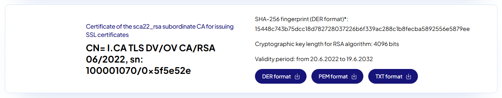

.. _certifikaty:

=======================
Certifikáty v CAAIS IdP
=======================

Uživatelský certifikát představuje jednu z možností ověření identity při přihlašování do CAAIS. Certifikát musí být vydán podporovanou certifikační autoritou a dostupný webovému prohlížeči na zařízení, ze kterého se uživatel přihlašuje.

.. admonition:: Poznámka
  :class: note
  
  Pro přihlášení do CAAIS prostřednictvím NIA nejsou uživatelské certifikáty nutné.

  Tato stránka je určena uživatelům, kteří se přihlašují pomocí autentizačního certifikátu.

Certifikáty podporované CAAIS
=============================

CAAIS podporuje uživatelské autentizační certifikáty vydané certifikačními autoritami uznávanými v rámci nařízení eIDAS. Certifikát může být uložen jako soubor (např. **PKCS#12**) nebo na fyzickém nosiči (**USB token, čipová karta**).

Typy certifikátů
----------------

Autentizační certifikát
^^^^^^^^^^^^^^^^^^^^^^^

Slouží k ověření identity uživatele při přihlašování do informačních systémů. Tento typ certifikátu je pro přihlášení do CAAIS podporován.

Kvalifikovaný certifikát pro elektronický podpis
^^^^^^^^^^^^^^^^^^^^^^^^^^^^^^^^^^^^^^^^^^^^^^^^

Slouží výhradně k vytváření kvalifikovaných elektronických podpisů a nelze jej použít k autentizaci do CAAIS ani jiných systémů.

.. admonition:: Poznámka
  :class: note
  
  Kvalifikovaný podpisový certifikát nelze použít k přihlášení do CAAIS.

  V některých případech je však spolu s ním vydáván i samostatný autentizační certifikát, který použít lze.

Podporované certifikační autority
---------------------------------

.. admonition:: Poznámka
  :class: note
  
  Interní certifikační autority jednotlivých úřadů nejsou z důvodu zvolené bezpečnostní politiky podporovány.

Aktuálně CAAIS podporuje autentizační certifikáty vydané následujícími certifikačními autoritami:

.. dropdown:: Národní certifikační autorita (NCA)

  `Národní certifikační autorita <https://www.narodni-ca.cz/>`_ je kvalifikovaný poskytovatel služeb vytvářejících důvěru, provozovaný Správou základních registrů (SZR). Vydávání certifikátů je upraveno nařízením EU eIDAS a zákonem č. 297/2016 Sb.

  NCA vydává certifikáty především pro potřeby veřejné správy. Držitelem certifikátu může být fyzická osoba působící ve veřejné instituci zapojené do projektu NCA. Certifikáty jsou vydávány ve standardu X.509 v3.

  Při využití certifikátů v CAAIS je nutné ověřit, že se jedná o autentizační certifikát. Kvalifikované certifikáty určené výhradně pro elektronický podpis nelze k přihlašování použít.

.. dropdown:: eIdentity

  `eIdentity <https://www.eidentity.cz/>`_ je komerční certifikační autorita poskytující kvalifikované i nekvalifikované certifikáty pro fyzické osoby. Proces pořízení certifikátu probíhá prostřednictvím zákaznického účtu na webu poskytovatele.

  Žádost o certifikát se podává online a zahrnuje vyplnění osobních údajů, ověření identity a následnou návštěvu registračního místa (v závislosti na typu certifikátu). Vydaný certifikát je následně k dispozici v elektronické podobě.

  Pro přihlášení do CAAIS je nutné zvolit autentizační certifikát. Kvalifikovaný certifikát pro elektronický podpis slouží pouze k podepisování dokumentů a nelze jej použít k autentizaci.

.. dropdown:: I.CA

  `I.CA <https://www.ica.cz/>`_ je zavedená certifikační autorita poskytující certifikáty pro elektronický podpis, šifrování i autentizaci. Žádost o certifikát lze podat online prostřednictvím průvodce na webu poskytovatele.

  Součástí procesu je ověření identity žadatele, které může proběhnout online nebo osobně na registrační autoritě. Certifikát lze uložit do počítače, na čipovou kartu nebo jiný podporovaný nosič.

  CAAIS podporuje autentizační certifikáty vydané I.CA. Při výběru certifikátu je nutné ověřit, že je určen pro přihlašování (autentizaci), nikoli pouze pro elektronický podpis.

.. dropdown:: PostSignum

  `PostSignum <https://www.postsignum.cz/>`_ je certifikační autorita provozovaná Českou poštou. Nabízí možnost získání certifikátu jak online, tak osobně na pobočkách České pošty (Czech POINT).

  Certifikát lze získat vzdáleně například pomocí eObčanky s aktivovaným čipem nebo prostřednictvím účtu MojeID s vysokou úrovní ověření. Alternativně je možné absolvovat proces osobně na vybraných pobočkách České pošty.

  Pro použití v CAAIS je nutné zvolit autentizační certifikát. Certifikáty určené výhradně pro elektronický podpis nejsou pro přihlášení do systému použitelné.

Jak certifikát získám
---------------------

Konkrétní postup získání certifikátu se liší podle zvolené certifikační autority. Obecně však proces zahrnuje následující kroky:

- Výběr certifikační autority.
- Podání žádosti o autentizační certifikát.
- Ověření totožnosti žadatele (online nebo osobně).
- Získání certifikátu ve formě souboru nebo na fyzickém nosiči.

Při žádosti vždy ověřte, že se jedná o autentizační certifikát, nikoli o certifikát určený výhradně pro elektronický podpis.

Jak přidám certifikáty do prohlížeče
====================================

Aby mohl být certifikát použit pro přihlášení do CAAIS, musí být nejprve dostupný webovému prohlížeči. Postup se liší podle operačního systému a typu prohlížeče.

.. dropdown:: Windows

  V operačním systému Windows využívají webové prohlížeče jednotné systémové úložiště certifikátů. Certifikát je nutné nejprve importovat do tohoto uložiště a ověřit, že je v prohlížeči dostupný.

  Taby pro Chromium, Firefox a Edge

.. dropdown:: Linux

  V systému GNU/Linux je zpravidla nutné certifikát importovat přímo do konkrétního webového prohlížeče. Postup se může lišit v závislosti na použité distribuci a prohlížeči.

.. dropdown:: macOS

  V systému macOS se certifikáty spravují prostřednictvím systémové aplikace Klíčenka. Certifikát musí být uložen v příslušném úložišti, aby jej mohl prohlížeč použít.

Často řešené potíže
-------------------

1. Chyba nezabezpečeného spojení v CMS
^^^^^^^^^^^^^^^^^^^^^^^^^^^^^^^^^^^^^^

Při přístupu k CAAIS v síti CMS (https://caais.cms2.cz či https://caais-edu.cms2.cz) dostávám chybu nezabezpečeného spojení – neznámé certifikační autority.

Na rozhraní do sítě CMS využívá CAAIS TLS certifikáty od I.CA, která bohužel není obsažena ve výchozím trust store webových prohlížečů. Výjimkou je prohlížeč Microsoft Edge, který využívá certifikáty Microsoft Trusted Root Certificate Program, kde I.CA zařazena je. Je tedy nutné použít webový prohlížeč Microsoft Edge, anebo do trust store prohlížeče přidat příslušný kořenový certifikát I.CA (údaje platné k 2026/02).

*Jak přidám certifikát I.CA do prohlížeče?*

Na stránce `I.CA <https://www.ica.cz/en/root-certificates>`_ stáhněte kořenový certifikát I.CA (Certificate of the sca22_rsa subordinate CA for issuing SSL certificates), kde stáhnete PEM format a importujte jej do trust store vašeho webového prohlížeče.

**Import PEM v Google Chrome**

1. V Google Chrome přejděte do nastavení a vyberte "Ochrana soukromí a zabezpečení" > "Zabezpečení" > "Správa certifikátů".
2. Do záložky "Vlastní" > "Důvěryhodné certifikáty" přidejte stažený PEM certifikát I.CA a potvrďte import.

**Import PEM v Mozilla Firefox**

1. V Mozzila Firefox otevřete "Nastavení" > "Soukromí a zabezpečení" > "Certifikáty".
2. V záložce "Zobrazit certifikáty", sloupci "Autority" lze importovat stažený PEM certifikát I.CA a potvrďte import.

2. Autentizace kvalifikovaným certifikátem
^^^^^^^^^^^^^^^^^^^^^^^^^^^^^^^^^^^^^^^^^^

Zkoušel jsem přidat certifikát QCA k uživateli a při tom jsem zjistil, že seznam certifikačních autorit v CAAIS je neúplný. Chybí v něm certifikační autorita pro QCA certifikáty PostSignum – CN=PostSignum QCA 4. Proč tato certifikační autorita v CAAIS chybí?

Kvalifikované certifikáty nelze pro autentizaci uživatelů použít, jsou určeny výhradně pro kvalifikovaný podpis dle eIDAS. Kvalifikované certifikáty neobsahují hodnotu Client Authentication (OID 1.3.6.1.5.5.7.3.2) v atributu Extended Key Usage (EKU). Toto omezení dané certifikační politikou brání zneužití kvalifikovaného podpisu. Je nutné použít certifikáty vydané jako komerční; v případě Postsignum se jedná o certifikáty podepsané mezilehlým certifikátem CN=PostSignum Public CA 4 či CN=PostSignum Public CA 5 (údaj platný k 2025/12). Tyto mezilehlé certifikáty CAAIS rozpoznává.
