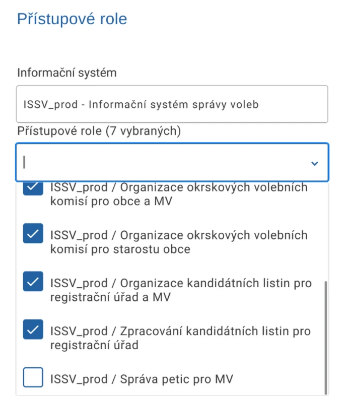

.. _faq:

====================
Často kladené otázky
====================

Účet v CAAIS
------------

1. Jak zjistím zda mám účet v CAAIS?
^^^^^^^^^^^^^^^^^^^^^^^^^^^^^^^^^^^^

Na webu `caais.gov.cz <https://caais.gov.cz/login>`_ vyberte možnost přihlášení přes **CAAIS IdP** a klikněte na volbu **Zapomněl jsem jméno**. Zadejte svou e-mailovou adresu. Pokud je k této adrese v CAAIS veden účet, bude Vám zaslán e-mail s dalšími instrukcemi. Pokud e-mail neobdržíte, účet pravděpodobně není založen.

2. Co mám dělat, když si nepamatuji přihlašovací údaje?
^^^^^^^^^^^^^^^^^^^^^^^^^^^^^^^^^^^^^^^^^^^^^^^^^^^^^^^

Na hlavní stránce CAAIS zvolte možnost přihlášení přes **CAAIS IdP**.

- Pokud si nepamatujete uživatelské jméno, klikněte na **Zapomněl jsem jméno** a zadejte svou e-mailovou adresu.
- Pokud si nepamatujete heslo, klikněte na **Zapomněl jsem heslo** a zadejte své uživatelské jméno.

Pokud je účet v systému evidován, bude Vám zaslán e-mail s dalšími instrukcemi.

3. Jak zjistím, kdo je můj lokální administrátor?
^^^^^^^^^^^^^^^^^^^^^^^^^^^^^^^^^^^^^^^^^^^^^^^^^

Pokud se vám nepodařilo přihlásit a domníváte se, že máte mít účet v CAAIS, obraťte se nejprve na pracovníka, který vám ve vaší organizaci nastavuje přístupy do JIP/KAAS nebo zajišťuje vydání komerčních či kvalifikovaných certifikátů.

Pokud se vám nepodaří lokálního administrátora tímto způsobem dohledat, kontaktujte technickou podporu CAAIS prostřednictvím e-mailové adresy **portal.szrcr.cz**.

4. Mohu být lokálním administrátorem u více subjektů?
^^^^^^^^^^^^^^^^^^^^^^^^^^^^^^^^^^^^^^^^^^^^^^^^^^^^^

Ano, je možné být lokálním administrátorem pro více subjektů. V takovém případě budete mít přístup k administraci všech těchto subjektů v rámci CAAIS.

5. Byl/a jsem jmenován/a lokálním administrátorem (LA) u dalšího subjektu. Proč mi nepřišel e-mail k vytvoření nového hesla?
^^^^^^^^^^^^^^^^^^^^^^^^^^^^^^^^^^^^^^^^^^^^^^^^^^^^^^^^^^^^^^^^^^^^^^^^^^^^^^^^^^^^^^^^^^^^^^^^^^^^^^^^^^^^^^^^^^^^^^^^^^^^

CAAIS umožňuje pouze jeden přihlašovací účet na jednu fyzickou osobu. Pokud již máte účet v CAAIS IdP zřízený u jiného subjektu, při jmenování do role u dalšího subjektu se nevytváří nový účet, ale pouze se k vašemu stávajícímu účtu přidá další profil. Z tohoto důvodu vám nepřijde nový e-mail k nastavení hesla. Po přihlášení si následně můžete vybrat subjekt, za který chcete pracovat.

6. Jsem LA u více subjektů. Jak se mám přihlašovat?
^^^^^^^^^^^^^^^^^^^^^^^^^^^^^^^^^^^^^^^^^^^^^^^^^^^

Vždy používáte stejné přihlašovací údaje (stejný účet v CAAIS IdP). Po úspěšném přihlášení si zvolíte subjekt, za který se chcete autorizovat. CAAIS neumožňuje mít více samostatných účtů pro jednu fyzickou osobu, ale umožňuje mít více profilů u různých subjektů.

7. Při použití „Zapomněl jsem heslo“ mi systém hlásí chybu nebo zobrazuje jinou e-mailovou adresu. Proč?
^^^^^^^^^^^^^^^^^^^^^^^^^^^^^^^^^^^^^^^^^^^^^^^^^^^^^^^^^^^^^^^^^^^^^^^^^^^^^^^^^^^^^^^^^^^^^^^^^^^^^^^^

Nejčastějším důvodem je, že:

- účet, který zadáváte, v CAAIS IdP neexistuje (protože už máte jiný účet),
- nebo používáte jiné uživatelské jméno, než které je vedeno u vašeho existujícího účtu.

Pokud jste byli nově jmenováni u dalšího subjektu, pravděpodobně již účet máte a nový se nevytvářel.

8. Nepamatuji si své uživatelské jméno. Jak ho zjistím?
^^^^^^^^^^^^^^^^^^^^^^^^^^^^^^^^^^^^^^^^^^^^^^^^^^^^^^^

V CAAIS IdP použijte funkci „Zapomněl jsem uživatelské jméno“ a zadejte e-mailovou adresu, kterou jste uvedl/a při založení nového profilu. V CAAIS IdP se u jedné fyzické osoby sdružují e-mailové adresy ze všech jejích profilů. Pokud je na základě zadaného e-mailu možné jednoznačně určit účet, systém vám zašle odpovídající uživatelské jméno.

9. Funkce „Zapomněl jsem uživatelské jméno“ mi nepomohla. Co může být důvod?
^^^^^^^^^^^^^^^^^^^^^^^^^^^^^^^^^^^^^^^^^^^^^^^^^^^^^^^^^^^^^^^^^^^^^^^^^^^^

Funkce funguje pouze tehdy, pokud je možné podle zadané e-mailové adresy jednoznačně určit konkrétní účet. Pokud je stejná e-mailová adresa použita u více fyzických osob, systém z bezpečnostních důvodů uživatelské jméno nezašle. V takovém případě se obraťte na Service Desk.

JIP/KAAS a CAAIS
----------------

1. Mohou oba systémy fungovat souběžně?
^^^^^^^^^^^^^^^^^^^^^^^^^^^^^^^^^^^^^^^

Ano. V praxi již nyní fungují vedle sebe – některé informační systémy vyžadují přihlášení prostřednictvím CAAIS, jiné prostřednictvím JIP/KAAS. V budoucnu bude CAAIS jediným systémem pro přihlašování do agendových informační systémů, ale přechod bude probíhat postupně.

2. Je možné migrovat data z JIP/KAAS do CAAIS?
^^^^^^^^^^^^^^^^^^^^^^^^^^^^^^^^^^^^^^^^^^^^^^

Ano, migraci dat lze provést přímo v prostředí CAAIS. Podrobný postup je popsán zde: `Přenos dat z JIP/KAAS do CAAIS <https://docs.caais.gov.cz/prirucka/prenos-dat/index.html>`_

3. Co se stane s údaji v JIP/KAAS, pokud nyní pracujeme v CAAIS?
^^^^^^^^^^^^^^^^^^^^^^^^^^^^^^^^^^^^^^^^^^^^^^^^^^^^^^^^^^^^^^^^^^

Údaje je možné převést z JIP/KAAS do CAAIS viz `Přenos dat z JIP/KAAS do CAAIS <https://docs.caais.gov.cz/prirucka/prenos-dat/index.html>`_. CAAIS zároveň umožňuje i zpětný zápis dat do JIP/KAAS.

4. Po přenosu dat z JIP/KAAS do CAAIS došlo ke vzniku duplicitních uživatelských účtů – jak postupovat?
^^^^^^^^^^^^^^^^^^^^^^^^^^^^^^^^^^^^^^^^^^^^^^^^^^^^^^^^^^^^^^^^^^^^^^^^^^^^^^^^^^^^^^^^^^^^^^^^^^^^^^^

Každý uživatel může mít v systému CAAIS pouze jeden účet. Ostatní účty, které mohly vzniknout v důsledku migrace, jsou vždy neaktivní a není potřeba s nimi pracovat. Přístupové role z JIP/KAAS se v tuto chvíli k aktivnímu účtu nepřiřazují automaticky, proto je nutné je doplnit manuálně. Do budoucna se počítá s automatickým párováním rolí k aktivnímu účtu a zároveň i s doplněním funkcionality pro odstranění duplicitních účtů.

5. Proč se při přenosu dat z JIP/KAAS zobrazila chybová zpráva a nedošlo k přenosu uživatelských profilů?
^^^^^^^^^^^^^^^^^^^^^^^^^^^^^^^^^^^^^^^^^^^^^^^^^^^^^^^^^^^^^^^^^^^^^^^^^^^^^^^^^^^^^^^^^^^^^^^^^^^^^^^^^

Nejčastější příčinou je nejedinečná e-mailová adresa u účtů v JIP/KAAS. Každý účet musí mít unikátní e-mail, který je nezbytný pro vytvoření a přihlášení do CAAIS.

6. Je systém CAAIS již finálně dokončen?
^^^^^^^^^^^^^^^^^^^^^^^^^^^^^^^^^^^^^^^^

CAAIS je v produkčním provozu. Stejně jako u jiných softwarových řešení probíhá jeho průběžný rozvoj a vylepšování.

Na koho se mohu obrátit s dotazem ohledně CAAIS
-----------------------------------------------

1. Jsme malá obec bez IT pracovníka. Kdo nám pomůže? Bude k dispozici helpdesk?
^^^^^^^^^^^^^^^^^^^^^^^^^^^^^^^^^^^^^^^^^^^^^^^^^^^^^^^^^^^^^^^^^^^^^^^^^^^^^^^

Obce obdrží informační dopis s dalšími instrukcemi.

K dispozici je:

- telefonická podpora na čísle 246 091 450 (aktivace od 16. 3. 2026),
- e-mailová adresa caais@dia.gov.cz,
- aplikace `Service Desk <https://portal.szrcr.cz/login-page>`_, pro řešení technických problémů.

Do aplikace `Service Desk <https://portal.szrcr.cz/login-page>`_ je možné se přihlásit prostřednictvím JIP / KAAS i CAAIS.

2. Od kdy bude helpdesk v provozu?
^^^^^^^^^^^^^^^^^^^^^^^^^^^^^^^^^^

Telefonická podpora je spuštěna od 16. 3. 2026.
E-mailová adresa caais@dia.gov.cz a aplikace `Service Desk <https://portal.szrcr.cz/login-page>`_ jsou již v provozu.

CAAIS a ISSV
------------

1. Kdo odpovídá za komplexní spuštění a zavedení CAAIS v rámci ISSV?
^^^^^^^^^^^^^^^^^^^^^^^^^^^^^^^^^^^^^^^^^^^^^^^^^^^^^^^^^^^^^^^^^^^^

Primární odpovědnost za spuštění ISSV, včetně integrace služeb CAAIS, nese Ministerstvo vnitra.

Samotný systém CAAIS je ve správě DIA a je již delší dobu v produkčním provozu. DIA se zároveň s Ministerstvem vnitra dohodla, že v souvislosti se spuštěním ISSV bude samosprávy hromadně informovat a poskytne jim metodickou podporu při zavádění CAAIS do praxe.

2. Přidělování rolí do ISSV končí neúspěchem „Nemáte dostatečné oprávnění na provedení akce“. Co s tím?
^^^^^^^^^^^^^^^^^^^^^^^^^^^^^^^^^^^^^^^^^^^^^^^^^^^^^^^^^^^^^^^^^^^^^^^^^^^^^^^^^^^^^^^^^^^^^^^^^^^^^^^

Pravděpodobně v přiřazovaných rolích vidíte také roli **ISSV Správa petic pro MV**, kterou nelze přidělit. Pokud tuto roli z nabídky odškrtnete, mělo by být možné role přidělit bez problémů. Jedná se o chybu na straně CAAIS, jejíž oprava bude nasazena v nejbližších dnech. Zatím prosím využijte popsaného náhradního řešení s odškrtnutím problematické role.

