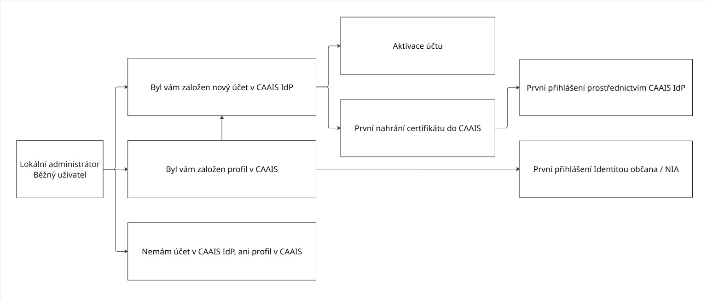

.. _la_prirucka:

================================
Příručka lokálního administátora
================================

**Centrální autentizační a autorizační informační systém (CAAIS)** je moderní řešení pro single sign-on do informačních systémů veřejné správy, které postupně nahrazuje JIP/KAAS. Pro lokálního administrátora představuje CAAIS centrální nástroj pro správu přístupů uživatelů, který umožňuje jednotné a bezpečné přihlašování do agendových informačních systémů (AIS).

Hlavní odpovědností lokálního administrátora v CAAIS je **zakládání a správa běžných uživatelů, přiřazování jejich rolí a oprávnění a průběžná údržba uživatelských účtů**. Současně lokální administrátor zajišťuje přenos uživatelských profilů z původního systému JIP/KAAS do CAAIS, a to s využitím připravených nástrojů, které umožňují zachovat stávající strukturu dat a návaznost na agendové informační systémy bez nutnosti jejich technických úprav.

.. grid:: 3

   .. grid-item-card:: :ref:`První přihlášení <la_prirucka_prihlaseni>`
      :text-align: center

   .. grid-item-card:: :ref:`Založení uživatele <la_prirucka_zalozeni_BU>`
      :text-align: center

   .. grid-item-card:: :ref:`Přenos z JIP / KAAS <prenos_dat>`
      :text-align: center   

Přehled celého procesu:

.. _la_prirucka_prihlaseni:

Přihlášení do CAAIS jako lokální administrátor
==============================================

Jakmile vám :ref:`statutární zástupce <sz_prirucka>` založí účet, budete o tom informováni prostřednictvím e-mailové zprávy s předmnětem **„Byl vám založen profil v CAAIS“** (a je potřeba se doztotožnit), případně s předmětem **„Byl vám založen nový účet v CAAIS IdP“** (pro již ztotožněné uživatele). Tento email obsahuje postup, podle kterého je potřeba provést první přihlášení a aktivaci vašeho uživatelského účtu.

.. grid:: 1

   .. grid-item-card:: :ref:`Přišel mi email „Byl vám založen profil v CAAIS“ <email_CAAIS>`
      :text-align: center

.. grid:: 1

   .. grid-item-card:: :ref:`Přišel mi email „Byl vám založen nový účet v CAAIS IdP“ <email_CAAIS_IdP>`
      :text-align: center

.. admonition:: Upozornění
   :class: warning
   
   **Pokud jste žádný email neobdrželi, pravděpodobně nemáte založen profil v CAAIS, ani účet v CAAIS IdP. V takovém případě kontaktujte vašeho statutárního zástupce, který je povinen Vám tento přístup zřídit.**

.. grid:: 1

   .. grid-item-card:: :ref:`Nemám profil v CAAIS, ani účet v CAAIS IdP“ <nemam_ucet>`
      :text-align: center

Správa vlastního účtu
=====================

Správa vlastního účtu je stejná pro :ref:`statutární zástupce <sz_prirucka>`, :ref:`lokálního administrátora <la_prirucka>` i :ref:`běžného uživatele <bu_prirucka>`.

.. grid:: 1

   .. grid-item-card:: :ref:`Jak spravovat svůj účet <sprava_uctu>`
      :text-align: center

.. _la_prirucka_zalozeni_BU:

Založení nového uživatele
=========================

.. dropdown:: Postup pro založení nového uživatele v CAAIS
   :open:
   
   1. Pro založení nového uživatele klikněte na položku **Uživatelé** v levém menu. Zobrazí se seznam všech již existujících uživatelů. Pokračujte kliknutím na **+UŽIVATEL**.

   .. figure:: ../images/LA_CAAIS-1.png
    :alt: Postup pro založení nového uživatele v CAAIS 1
    :width: 1000px
   
   2. Budete přesměrováni na formulář, kde vyplníte základní údaje o uživateli.

   .. admonition:: Upozornění
      :class: warning

      **Povinná políčka jsou označena hvězdičkou. Uživatelské jméno se vygeneruje automaticky na základě jména a příjmení, zvolit ovšem můžete i vlastní.**
   
   Důležité je správně zadat e-mailovou adresu, kam zakládanému uživateli přijde e-mail informující ho o založení účtu a obsahující přihlašovací údaje (pokud budete vyplňovat i telefonní číslo, vždy zvolte možnost mobilní nikoliv pevná linka.)

   .. figure:: ../images/LA_CAAIS-2.png
    :alt: Postup pro založení nového uživatele v CAAIS 2
    :width: 1000px
   
   3. Dalším krokem je kontrola ztotožnění uživatele. Ztotožnění je možné provést několika způsoby:

   **A)** Druh a číslo dokladu
   **B)** Datum narození
   **C)** Uživatel se ztotožní sám (**DOPORUČENO**)

   **A)** v sekci Kontrola totožnosti uživatele zaškrtněte volbu **„Druh a číslo dokladu”**. Z rolovací nabídky vyberte požadovaný druh dokladu a do vedlejšího pole vyplňte jeho číslo. Klikněte na tlačítko **ZTOTOŽNIT**.

   **B)** ztotožnění prostřednictvím data narození zaškrtněte volbu **„Datum narození”**. Vyplňte číslice nebo navolte datum prostřednictvím vyskakovacího kalendáře. Klikněte na tlačítko **ZTOTOŽNIT**.

   .. admonition:: Upozornění
      :class: warning
      
      Pokud byla nalezena jedinečná osoba s uvedeným datem narození, je uživatel úspěšně ztotožněn. V opačném případě se zobrazí hláška „Podle zadaných údajů jsme nalezli více osob. Doplňte další údaje pro přesnější vyhledání v registru obyvatel.“ a systém vás vyzve k doplnění dalších osobních údajů. Po jejich úspěšné kontrole se v horní části obrazovky zobrazí zelený proužek informující o úspěšném ztotožnění a založení uživatelského profilu.
   
   **C)** při zakládání uživatelského profilu se můžete dostat do situace, kdy nebudete mít k dispozici potřebné osobní údaje. V tom případě využijte možnost tzv. samoztotožnění uživatele. Uživateli přijde e-mail s předmnětem :ref:`„Byl vám založen profil v CAAIS“ <email_CAAIS>` (a je potřeba se doztotožnit). 

   .. admonition:: Poznámka
      :class: note
      
      Na stránce naleznete defaultně vybranou volbu **„Poskytnout přihlašování pomocí údajů v CAAIS“**. Znamená to, že systém zajistí odeslání notifikace uživateli s výzvou k aktivaci účtu, případně k tzv. doztotožnění. Pokud tuto možnost nezvolíte, uživatel se nebude moci přihlašovat pomocí přihlašovacích údajů vydaných v CAAIS IdP, nicméně účet mu vznikne a bude se moci přihlašovat pomocí jiných prostředků, jmenovitě pomocí NIA.

   .. figure:: ../images/LA_CAAIS-3.png
    :alt: Postup pro založení nového uživatele v CAAIS 3
    :width: 1000px

   .. admonition:: Upozornění
      :class: warning

      Pokud se dostanete do situace, kdy nebude možné zakládaného uživatele ztotožnit běžným způsobem, můžete požádat národního administrátora o tzv. **výjimku ze ztotožnění**.

      Postupujte stejným způsobem jako při zakládání uživatele. I v případě, kdy víte, že ztotožnění na základě čísla dokladu není možné, vyplňte do pole libovolné číslo. Objeví se červená hláška „Podle zadaných údajů jsme osobu v registru obyvatel nenašli“. Zároveň se zobrazí i nová možnost **„Pokračovat bez ztotožnění“**.

      Označte možnost „Pokračovat bez ztotožnění“ a pokračujte kliknutím na **ZTOTOŽNIT**.

      .. figure:: ../images/LA_CAAIS-4.png
         :alt: Postup pro založení nového uživatele v CAAIS 4
         :width: 1000px
      
      Budete přesměrováni na stránku **„Údaje pro výjimku ze ztotožnění“**. Zde vyplňte požadované údaje a klikněte na tlačítko **ZTOTOŽNIT**.

      .. figure:: ../images/LA_CAAIS-5.png
         :alt: Postup pro založení nového uživatele v CAAIS 5
         :width: 1000px
      
      Zobrazí se zelený proužek informující o založení uživatelského profilu a odeslání požadavku národnímu administrátorovi.
      
      Dokud Národní administrátor žádost nevyřídí, naleznete ji v levém menu pod „Podané žádosti“. Na stejném místě ji můžete i smazat kliknutím na ikonu koše. Jakmile je žádost schválená, v seznamu uživatelů se u dané osoby zobrazí příznak „Aktivní” a zároveň je jí odeslán e-mail obsahující uživatelské jméno a link pro první přihlášení.

      .. figure:: ../images/LA_CAAIS-6.png
         :alt: Postup pro založení nového uživatele v CAAIS 6
         :width: 1000px

   4. Objeví se zelený proužek informující o úspěšném založení profilu a uživateli je zároveň poslán e-mail s odkazem na stránku, na níž ztotožnění dokončí. Pozor, odkaz má omezenou platnost. (platnost je 30 dní!)

   .. figure:: ../images/LA_CAAIS-7.png
    :alt: Postup pro založení nového uživatele v CAAIS 7
    :width: 1000px

   .. admonition:: Poznámka
      :class: note
      
      Dokud uživatel proces ztotožnění nedokončí, bude se u jeho jména zobrazovat atribut **„Před ztotožněním“**. I uživateli s tímto atributem lze přidělit roli lokálního administrátora.

.. admonition:: Poznámka
   :class: note
      
   Pokud běžný uživatel, kterému má být přidělena role lokálním administrátorem už účet v CAAIS má. V tomto případě v záložce **Uživatelé** zvolím možnost filtrovat a uživatele najdu.

   .. figure:: ../images/LA_CAAIS-8.png
      :alt: Postup pro založení nového uživatele v CAAIS 8
      :width: 1000px

uživatelské jméno nelze (zatím) měnit, vhodná konvence

Přiřazení rolí
--------------

Úkolem lokálního administrátora je také přiřazení rolí uživatelům, aby se mohli přihlásit do konkrétních informačních systémů. Pro tento úkol existují dva základní způsoby:

.. dropdown:: Přiřazení role v detailu uživatele
   
   Po přihlášení do CAAIS musí lokální administrátor přiřadit běžným uživatelům přístupové role ke konkrétním informačním systémům. V záložce **Správa rolí** v detailu uživatele kontrolujete, případně přidáváte a odebíráte konkrétnímu uživateli příslušné role. Jedná se o organizační, skupinové, přístupové a činnostní role. Seznam rolí, které má uživatel k dispozici, zobrazíte po rozkliknutí příslušného názvu role.

   .. figure:: ../images/LA_CAAIS_role-1.png
      :alt: Přiřazení role v detailu uživatele
      :width: 1000px

   Jestliže se chystáte stejnou roli přidělovat několika uživatelům, je efektivnější přejít do volby **Správa rolí** nacházejícím se v levém menu viz :ref:`Přiřazení role uživatelům k agendovému informačnímu systému <la_prirucka_prirazeni_role_ais>`.

.. _la_prirucka_prirazeni_role_ais:

.. dropdown:: Přiřazení role uživatelům k agendovému informačnímu systému

   Do komplexního prostředí pro správu rolí, které byly vašemu subjektu uděleny garanty jednotlivých AIS, nebo které vašemu subjektu náleží na základě RPP, se dostanete přes levé menu volbou **Správa rolí**.

   .. admonition:: Poznámka
      :class: note

      Přidělování rolí doporučujeme provádět právě zde, kde můžete nad seznamem uživatelů filtrovat a snáze přidat jednu roli více uživatelům najednou.
   
   **Přístupové role**

   Po rozkliknutí řádku **Přístupové role** uvidíte v úvodní záložce seznam veškerých přístupových rolí, které byly vašemu subjektu uděleny garanty jednotlivých Agendových informačních systémů.

   Kliknutím na řádek konkrétní role se dostanete na její detail se základními údaji.

   .. figure:: ../images/LA_CAAIS_role-2.png
      :alt: Přiřazení role přes správu rolí 1
      :width: 1000px

   V detailu AIS na záložce **Uživatelé** se nachází seznam uživatelů vašeho subjektu, kteří mají danou roli přidělenou. Na tomto místě můžete příslušnou roli uživatelům odebírat nebo přidávat kliknutím na tlačítko **EDITOVAT**.

   .. figure:: ../images/LA_CAAIS_role-3.png
      :alt: Přiřazení role přes správu rolí 2
      :width: 1000px

   **Agendy a činnostní role**

   Položky v záložce **Agendy a činnostní role** jsou synchronizovány s oprávněními vašeho subjektu dle RPP.

   .. figure:: ../images/LA_CAAIS_role-4.png
      :alt: Přiřazení agendy a činnostní role 1
      :width: 1000px

   Rozkliknutím řádku se dostanete na **základní údaje** dané činnostní role.

   .. figure:: ../images/LA_CAAIS_role-5.png
      :alt: Přiřazení agendy a činnostní role 2
      :width: 1000px

   Po rozkliknutí záložky **Uživatelé** se zobrazí seznam uživatelů vedených pod vaším subjektem, kteří mají příslušnou roli přidělenou. Zde můžete roli uživatelům odebírat nebo přidávat kliknutím na tlačítko **EDITOVAT**.

   .. figure:: ../images/LA_CAAIS_role-6.png
      :alt: Přiřazení agendy a činnostní role 3
      :width: 1000px

Organizační role
^^^^^^^^^^^^^^^^

Organizační role zjednodušují proces přiřazování rolí, jelikož umožňují zkombinovat přístupové role, činnostní role a skupiny rolí takovým způsobem, aby odpovídal například pracovní pozici.

.. dropdown:: Vytvoření organizační role

   Pro vytvoření nové organizační role klikněte na tlačítko **+ ORGANIZAČNÍ ROLE**. Vyplňte její název, případně popis a garanta a klikněte na **POKRAČOVAT**.

   Na další stránce vyberte **přístupové role**, **činnostní role** a **skupiny rolí**, které má zakládaná organizační role obsahovat. Kombinace těchto rolí je zcela na vašem uvážení.

   1. Pro přiřazení přístupových a činnostních rolí klikněte na řádek **Skupiny rolí**. Zobrazí se rolovací nabídka již existujících skupin rolí. Vyberte jednu nebo více rolí.

   .. admonition:: Poznámka
      :class: note

      Vyberete-li možnost **„Jednorázové přidělení“**, dojde k přidělení skupinové role nebo rolí v aktuální podobě. To znamená, že pokud dotčenou skupinu rolí v budoucnu upravíte, provedené změny se v rámci organizační role neprojeví.

   2. Obdobně přidáte do organizační role i dílčí role přístupové a činnostní.

   3. Jakmile máte všechny role přiřazené, klikněte na tlačítko **ZALOŽIT**.

   Organizační roli lze vytvořit i podle vzoru. Zaškrtněte možnost **„Vytvořit organizační roli podle vzoru”**. Vytvoření organizační role podle vzoru vybraného uživatele vaší organizace je vhodné, jestliže některý z uživatelů disponuje kombinací rolí vhodných pro konkrétní pracovní zařazení. Vyberte jméno takového uživatele z rolovací nabídky a klikněte na **„Zkopírovat obsah role“**.

.. dropdown:: Editace organizační role

   K základním údajům organizační role, jež můžete na stejném místě i editovat, se dostanete rozkliknutím příslušného řádku.

   Na záložce Detail role lze upravit, z jakých jednotlivých rolí se má organizační role skládat.

   V záložce Uživatelé naleznete seznam uživatelů, kterým byla konkrétní organizační role přidělena. Přidávat a odebírat roli uživatelům můžete kliknutím na tlačítko EDITOVAT.

Skupiniové role
^^^^^^^^^^^^^^^

Skupiny rolí zjednodušují proces přiřazování rolí, jelikož umožňují kombinovat přístupové a činnostní role, které má váš subjekt k dispozici.

.. dropdown:: Vytvoření skupiny rolí

   Pro vytvoření nové skupiny rolí. Pokud jste již nějakou skupinu rolí vytvořili a přidělili konkrétnímu uživateli, můžete vytvořit další skupinu rolí podle tohoto vzoru.

   1. Klikněte na + SKUPINA ROLÍ.

   2. Otevře se stránka s názvem „Nová skupina rolí”.

   .. admonition:: Poznámka
      :class: note

      Pokud jste již nějakou skupinu rolí vytvořili a přidělili konkrétnímu uživateli, můžete vytvořit další skupinu rolí podle tohoto vzoru.

   3. Přidejte přístupové role. Rozklikněte příslušný řádek a z nabídky vyberte AIS (agendový informační systém), jehož přístupovou roli nebo role chcete přidat. Zaškrtněte požadované přístupové role.
   Pokud chcete přidat přístupové role k dalšímu AIS, vyberte z rolovací nabídky jeho jméno a opět i požadovanou přístupovou roli/role. Všechny zvolené role se zobrazí v modrých rámečcích pod rolovací nabídkou.

   .. admonition:: Poznámka
      :class: note

      Jestliže chcete některou z nich odstranit, klikněte na křížek na pravé straně rámečku.

.. dropdown:: Editace skupiny rolí

   Rozkliknutím řádku se dostanete k základním údajům dané skupinové role. V záložce Detail role můžete změnit skladbu skupinové role, tedy změnit složení přístupových a činnostních rolí, které ji tvoří.

   V záložce Uživatelé najdete seznam všech uživatelů, kteří mají tuto skupinu rolí přidělenu. Přidávat a odebírat ji uživatelům můžete po kliknutí na tlačítko EDITOVAT.