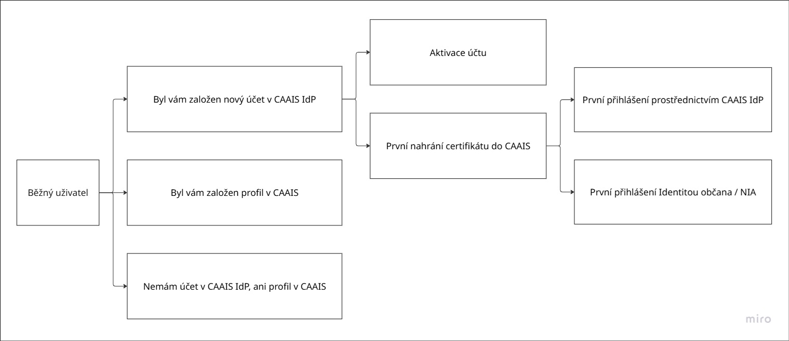

.. _la_prirucka:

================================
Příručka lokálního administátora
================================

**Centrální autentizační a autorizační informační systém (CAAIS)** je moderní řešení pro single sign-on do informačních systémů veřejné správy, které postupně nahrazuje JIP/KAAS. Pro lokálního administrátora představuje CAAIS centrální nástroj pro správu přístupů uživatelů, který umožňuje jednotné a bezpečné přihlašování do agendových informačních systémů (AIS).

Hlavní odpovědností lokálního administrátora v CAAIS je **zakládání a správa běžných uživatelů, přiřazování jejich rolí a oprávnění a průběžná údržba uživatelských účtů**. Současně lokální administrátor zajišťuje přenos uživatelských profilů z původního systému JIP/KAAS do CAAIS, a to s využitím připravených nástrojů, které umožňují zachovat stávající strukturu dat a návaznost na agendové informační systémy bez nutnosti jejich technických úprav.

.. grid:: 3

   .. grid-item-card:: :ref:`První přihlášení <la_prirucka_prihlaseni>`
      :text-align: center

   .. grid-item-card:: :ref:`Založení uživatele <la_prirucka_zalozeni_BU>`
      :text-align: center

   .. grid-item-card:: :ref:`Přenos z JIP / KAAS <prenos_dat>`
      :text-align: center   

Přehled celého procesu:

.. _la_prirucka_prihlaseni:

Přihlášení do CAAIS jako lokální administrátor
==============================================

Jakmile vám :ref:`statutární zástupce <sz_prirucka>` založí účet, budete o tom informováni prostřednictvím e-mailové zprávy s předmnětem **„Byl vám založen profil v CAAIS“** (a je potřeba se doztotožnit), případně s předmětem **„Byl vám založen nový účet v CAAIS IdP“** (pro již ztotožněné uživatele). Tento email obsahuje postup, podle kterého je potřeba provést první přihlášení a aktivaci vašeho uživatelského účtu.

.. grid:: 1

   .. grid-item-card:: :ref:`Přišel mi email „Byl vám založen profil v CAAIS“ <email_CAAIS>`
      :text-align: center

.. grid:: 1

   .. grid-item-card:: :ref:`Přišel mi email „Byl vám založen nový účet v CAAIS IdP“ <email_CAAIS_IdP>`
      :text-align: center

.. admonition:: Upozornění
   :class: warning
   
   **Pokud jste žádný email neobdrželi, pravděpodobně nemáte založen profil v CAAIS, ani účet v CAAIS IdP. V takovém případě kontaktujte vašeho statutárního zástupce, který je povinen Vám tento přístup zřídit.**

.. grid:: 1

   .. grid-item-card:: :ref:`Nemám profil v CAAIS, ani účet v CAAIS IdP“ <nemam_ucet>`
      :text-align: center

Správa vlastního účtu
=====================

Správa vlastního účtu je stejná pro :ref:`statutární zástupce <sz_prirucka>`, :ref:`lokálního administrátora <la_prirucka>` i :ref:`běžného uživatele <bu_prirucka>`.

.. grid:: 1

   .. grid-item-card:: :ref:`Jak spravovat svůj účet <sprava_uctu>`
      :text-align: center

.. _la_prirucka_zalozeni_BU:

Založení nového uživatele
=========================

postup, uživatelské jméno nelze (zatím) měnit, vhodná konvence

Ztotožnění versus samoztotožnění
--------------------------------

Přiřazení certifikátu (volitelně)
---------------------------------

Přiřazení rolí
--------------

