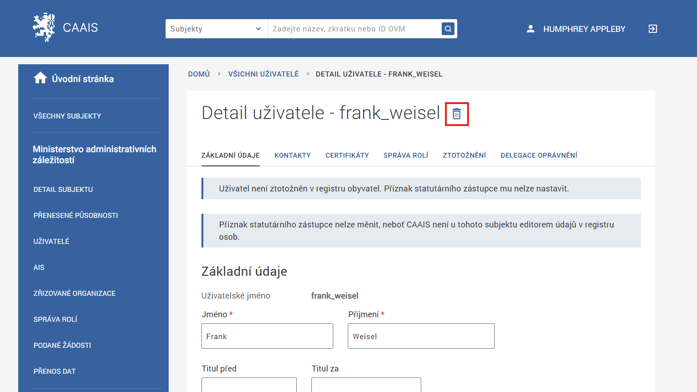
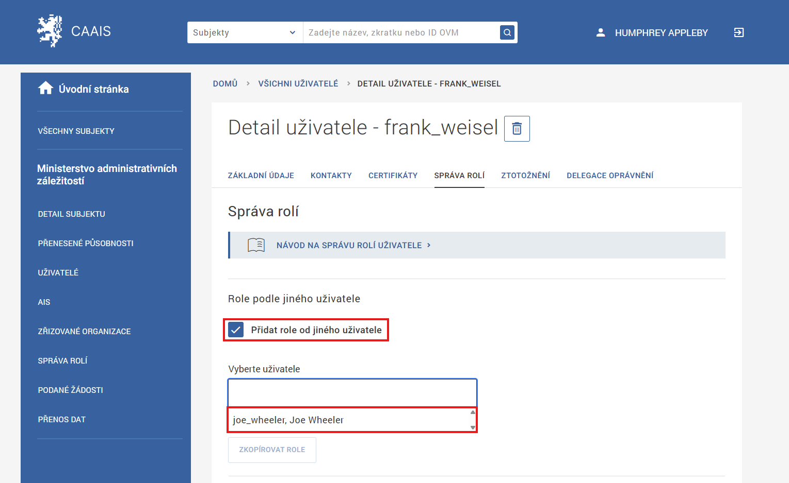
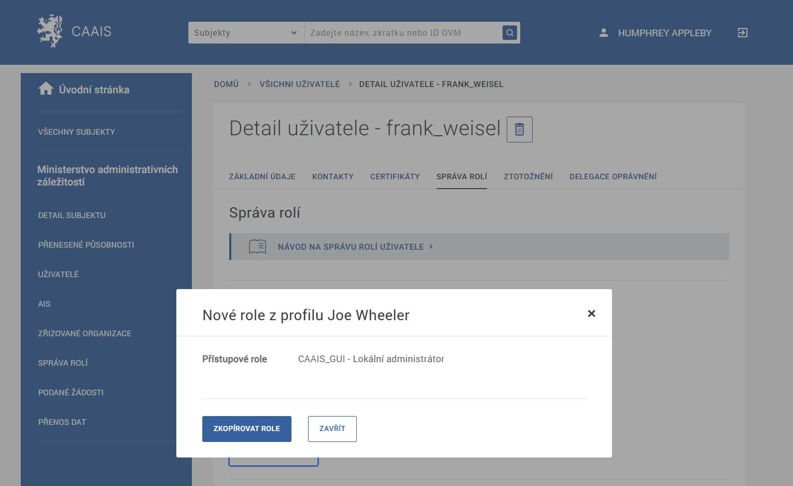

================================
Příručka lokálního administátora
================================

Správa uživatelů subjektu
=========================

.. _mazani_neaktivniho_profilu:

Smazání dosud neaktivovaného profilu
------------------------------------

U profilů ve stavu *před ztotožněním*, *ke schválení* či *zamítnuto* je možné smazat profil přímo v detailu tohoto profilu. U profilů ve stavu ke schválení a zamítnuto se spolu s profilem maže i patřičná žádost o výjimku ze ztotožnění. Smazání profilu je možné po kliknutí na ikonu popelnice v detailu profilu.

.. admonition:: Poznámka
   :class: note
   
   Tato funkcionalita se zpravidla využívá v případě, že byl při přenosu uživatelských účtů z JIP/KAAS do CAAIS vytvořen duplicitní profil uživatele, který již účet v CAAIS měl. V takovém případě je vhodné duplicitní profil odstranit.

.. _kopirovani_roli:

Kopírování rolí z jednoho uživatelského profilu k jinému
--------------------------------------------------------

Přiřazení rolí uživateli je též možno provést dávkově na základě nastavení rolí jiného uživatele na daném subjektu. Po zaškrtnutí políčka **Přidat role od jiného uživatele** se zobrazí výběr uživatelů, od kterého je možné role překopírovat.

V rozbalovací nabídce pro výběr uživatelů je možné vyhledávat a zobrazí se zde pouze uživatelé ze stejného subjektu, jako právě vybraný cílový uživatel.

Po výběru uživatele, který bude použit jako zdroj šablony rolí, se zobrazí přehled rolí, které budou překopírovány. Jedná se o přehledové okno, které neumožňuje editaci.

Operaci je možné poté provést pomocí tlačítka **Zkopírovat role**.

Následně je možné zkontrolovat námi provedené přidělení rolí v jednotlivých kategoriích zde na záložce Správa rolí v detailu uživatele.

Přidělení nových rolí je možno potvrdit pomocí tlačítka **Uložit**.

Vždy se jedná pouze o plné překopírování všech rolí z jednoho uživatele na druhého. Výjimku tvoří pouze přístupové role v systému CAAIS. Zde proběhne překopírování jenom těch rolí, které má aktuálně přihlášený uživatel podle své přístupové role právo přidělovat.

.. admonition:: Poznámka
   :class: note
   
   Tato funkcionalita se zpravidla využívá v případě, kdy je potřeba přiřadit stejnou sadu rolí více uživatelům, například při přenosu uživatelských účtů z JIP/KAAS do CAAIS.
