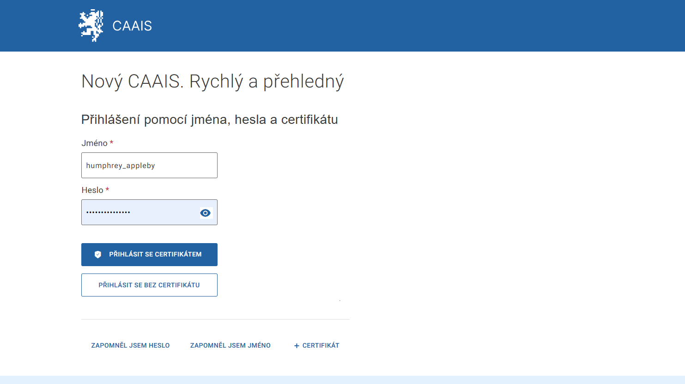

.. _prihlaseni_CAAIS_IdP:

Přihlášení CAAIS IdP – jméno, heslo a certifikát
================================================

1. Na přihlašovací stránce vyberte možnost **CAAIS IdP**.

2. Vyplňte uživatelské jméno a heslo. Klikněte na tlačítko **PŘIHLÁSIT CERTIFIKÁTEM**.

.. admonition:: Poznámka
   :class: note
   
   Do CAAIS je možné se přihlásit i bez certifikátu. V takovém případě ale nejste oprávněni editovat údaje. Můžete pouze nahlížet do svého účtu.

3. V prohlížeči vyskočí okno. V něm vyberte certifikát, který jste již dříve do systému nahráli.

.. admonition:: Poznámka
   :class: note
   
   Pokud se přihlašujete opakovaně, je možné, že si prohlížeč váš certifikát zapamatoval a jeho volbu již nevyžaduje.

4. Jste přihlášeni a vstupujete do systému s právy odpovídající vaší přístupové roli.

.. admonition:: Upozornění
   :class: warning
   
   **Jestliže se vám přihlášení nedaří, protože se například neotevřelo okno s certifikáty, a vy jste tak neměli možnost vybrat ze seznamu správný certifikát, zkuste v prohlížeči otevřít nové anonymní okno a postup zopakovat.**