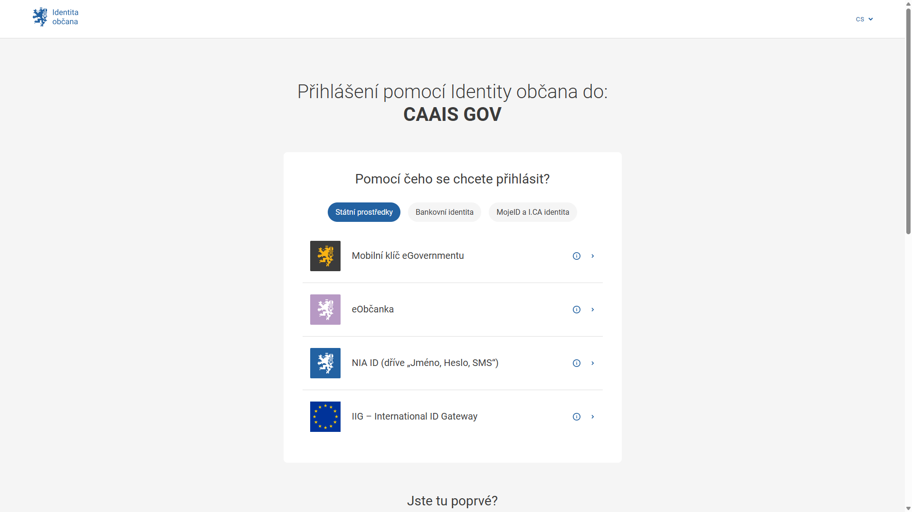

.. _prihlaseni_NIA:

Přihlášení Identitou občana / NIA
=================================

1. Na přihlašovací stránce vyberte možnost **NIA – Přihlášení pomocí identity občana**.

2. Zvolte způsob autentizace.

3. CAAIS vás rozpozná na základě informací poskytnutých NIA a vpustí do systému s právy odpovídajícími vaší přístupové roli.