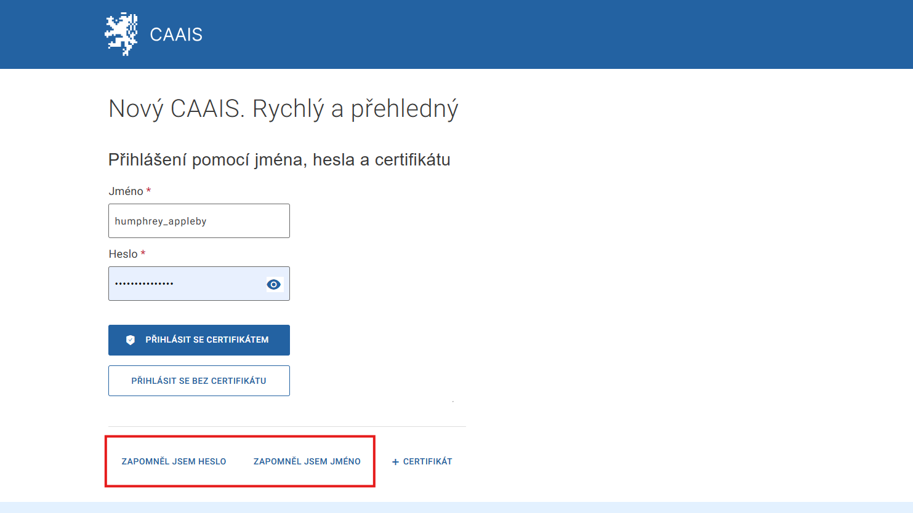

.. _zapomenute_udaje:

Zapomenuté údaje
================

Zapomenuté uživatelské jméno
----------------------------

Pokud jste zapomněli své uživatelské jméno:

1. Klikněte na text **ZAPOMNĚL JSEM JMÉNO**.

2. Vyplňte e-mailovou adresu, kterou máte spárovanou s vaším účtem a klikněte na VYHLEDAT.

3. Na obrazovce se zobrazí hláška „Vaše uživatelské jméno jsme vám odeslali na zadaný e-mail“.

Jestliže jste ve schránce zprávu s uživatelským jménem nenalezli, je možné, že jste zadali chybnou adresu. Se zjištěním té správné vám pomůže :ref:`lokální administrátor <bu_prirucka_LA>`.

Zapomenuté heslo
----------------

Při zapomenutí hesla postupujte následovně:

1. Klikněte na text **ZAPOMNĚL JSEM HESLO**.

2. Vyplňte své uživatelské jméno a klikněte na tlačítko POKRAČOVAT.

3. Pokud bylo vaše jméno v databázi nalezeno, systém vám odešle e-mail nebo SMS s jednorázovým kódem.

4. Na další stránce vyplňte obdržený kód a zvolte si nové heslo.

O změně hesla informuje zelený proužek „Nastavili jsme vám nové heslo. Teď se můžete přihlásit.“

Pokud vaše uživatelské jméno nebylo nalezeno, to znamená, že jste neobdrželi e-mail, zkontrolujte, zda jste jej zadali správně, případně se obraťte na :ref:`lokálního administrátora <bu_prirucka_LA>`.