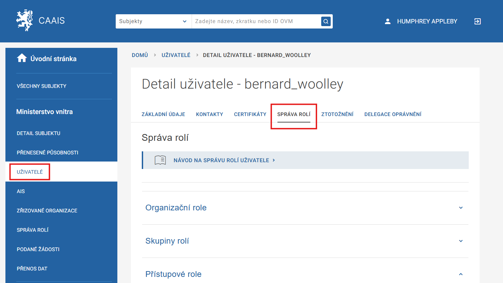
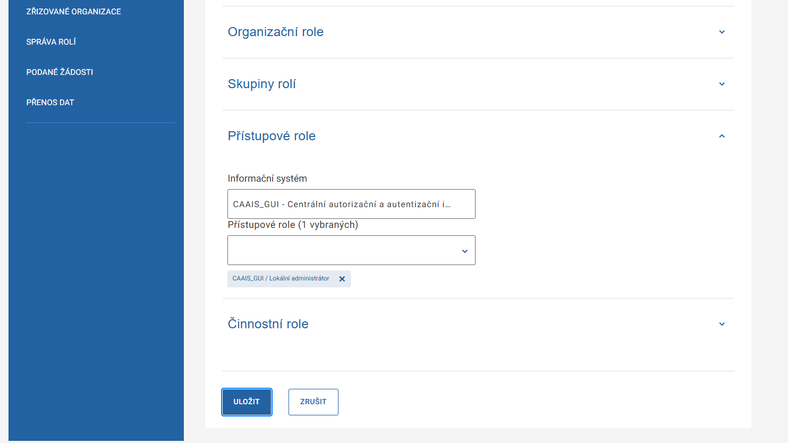

.. _sz_prirucka_odebrani_la:

Odebrání role lokálního administrátora
^^^^^^^^^^^^^^^^^^^^^^^^^^^^^^^^^^^^^^

.. admonition:: Upozornění
   :class: warning
   
   **Statutární zástupce je jedinou osobou, která může roli lokálního administrátora nejen udělit, ale i odejmout.**

1. V levém menu zvolte položku Uživatelé.
2. Zobrazí se seznam všech uživatelů spadajících pod váš subjekt. Vyberte toho, kterému chcete roli přidělit, případně odebrat a klikněte na jeho jméno (využít můžete i funkci filtrování). Systém vás přesměruje na detail vybraného uživatelského účtu.
3. Zvolte záložku **Správa rolí** a rozklikněte možnost **Přístupové role**.

4. Pokud roli odebíráte, smažte ji kliknutím na symbol křížku a volbu uložte. Systém vás bude o změně informovat prostřednictvím datové zprávy, uživateli pak přijde notifikační e-mail.

