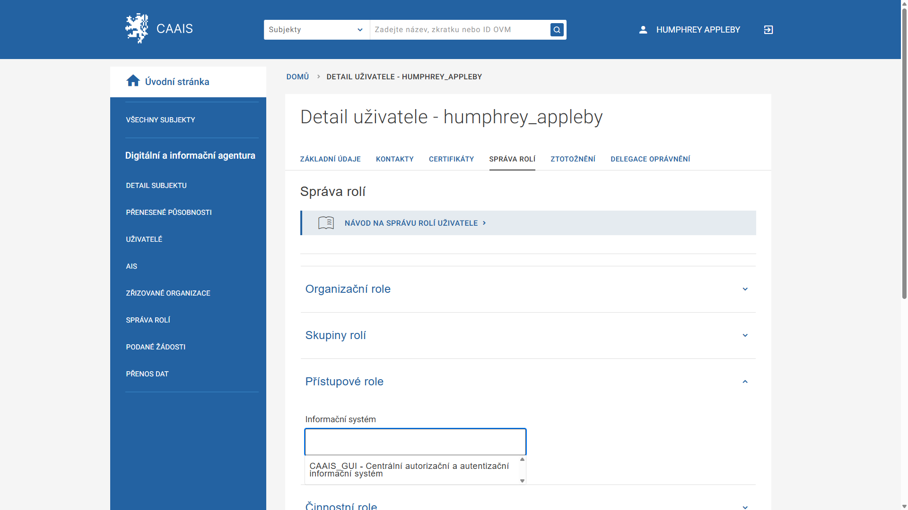

.. _sz_prirucka_prideleni_la:

Přidělení role lokálního administrátora
^^^^^^^^^^^^^^^^^^^^^^^^^^^^^^^^^^^^^^^

O úspěšném založení profilu jste informování už na pozadí stránky jeho detailu. Zde můžete přepínat mezi lištami Základní údaje, Kontakty, Certifikáty a Správa rolí. Pro přidělení role zvolte **Správa rolí**.

1. Rozklikněte volbu Přístupové role
2. Z nabídky „Informační systém“ vyberte **„CAAIS_GUI - Centrální autorizační a autentizační informační systém“**.

3. Objeví se nabídka přístupových rolí. Zaškrtněte volbu **„CAAIS_GUI / Lokální administrátor“** a klikněte na **ULOŽIT**.