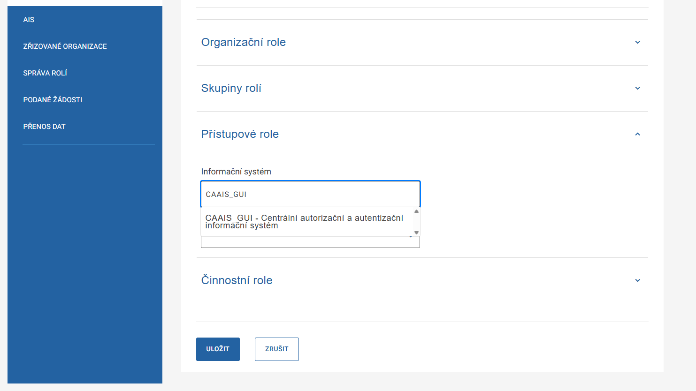
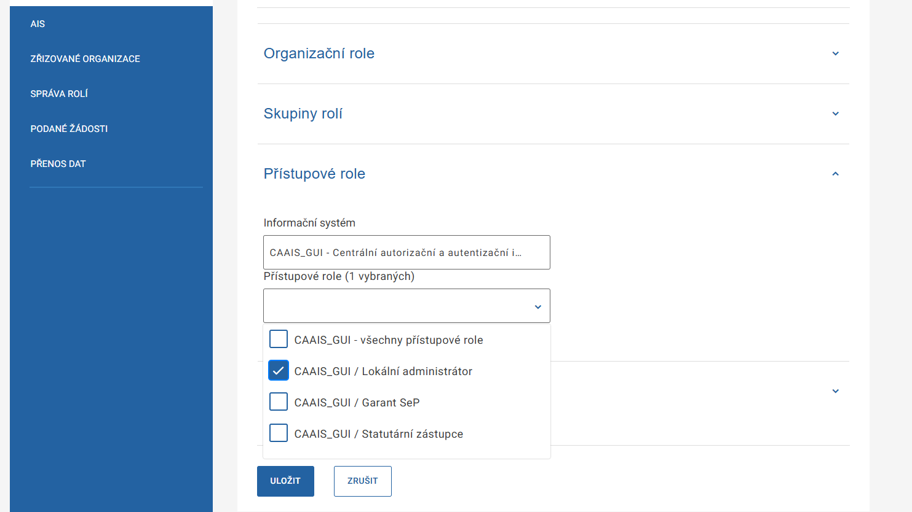

.. _sz_prirucka_prideleni_la:

Přidělení role lokálního administrátora
^^^^^^^^^^^^^^^^^^^^^^^^^^^^^^^^^^^^^^^

.. admonition:: Upozornění
   :class: warning
   
   **Přidělit a odebrat roli lokálního administrátora může jen statutární zástupce subjektu, a to vždy u konkrétního uživatele v záložce Správa rolí.**

1. V levém menu zvolte položku Uživatelé.
2. Zobrazí se seznam všech uživatelů spadajících pod váš subjekt. Vyberte toho, kterému chcete roli přidělit, případně odebrat a klikněte na jeho jméno (využít můžete i funkci filtrování). Systém vás přesměruje na detail vybraného uživatelského účtu.
3. Zvolte záložku **Správa rolí** a rozklikněte možnost **Přístupové role**.

.. figure:: ../images/SZ_prideleni_LA-1.png
    :alt: Přidělení role lokálního administrátora
    :width: 1000px

4. Z nabídky „Informační systém“ vyberte **„CAAIS_GUI - Centrální autorizační a autentizační informační systém“**.

5. Objeví se nabídka přístupových rolí. Zaškrtněte volbu **„CAAIS_GUI / Lokální administrátor“** a klikněte na **ULOŽIT**.

.. admonition:: Upozornění
   :class: warning
   
   **Role lokálního administrátora je jedinou rolí, kterou může statutární zástupce administrovat. Pokud chcete spravovat i další role, přidělte roli lokálního administrátora sami sobě.**