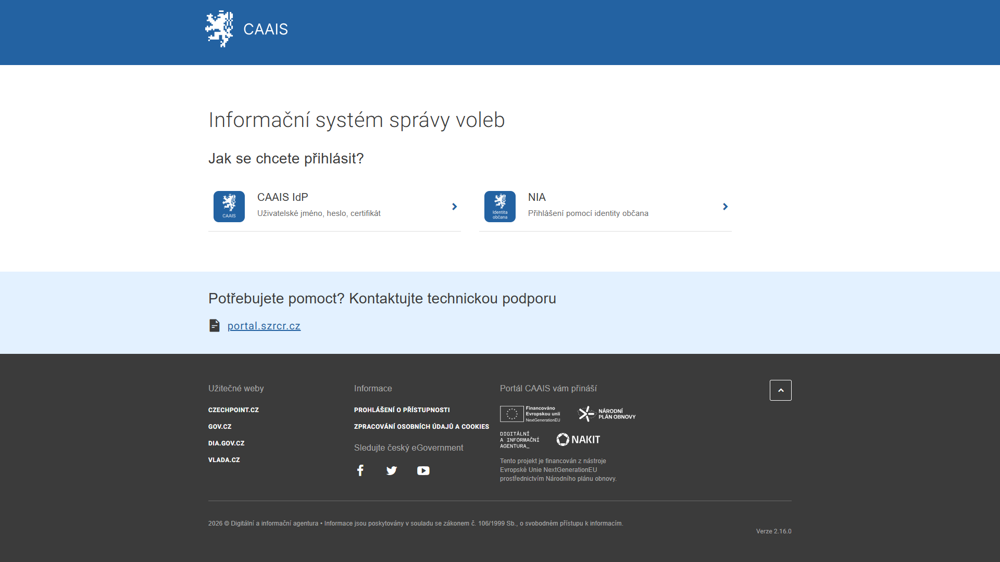
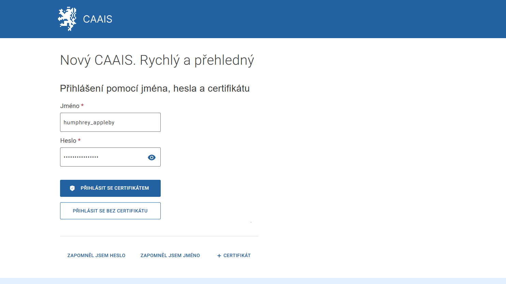

.. _prihlaseni_AIS_CAAIS_IdP:

Přihlášení k AIS přes CAAIS IdP
-------------------------------

Pokud zvolíte ověření pomocí „CAAIS IdP”, je vaše identita ověřena na základě přístupových údajů, tedy obvykle **přihlašovacího jména, hesla a certifikátu**. Agendový informační systém obdrží informaci o vaší úspěšné autentizaci včetně sady vašich oprávnění (přístupových a činnostních rolí).

Po vyplnění uživatelského jména a hesla klikněte na **„Přihlásit se certifikátem“ / „Přihlásit se bez certifikátu”** (dle požadovaného zabezpečení). Po volbě přihlášení certifikátem vyskočí v prohlížeči okno. V něm vyberte certifikát, který jste již dříve do systému CAAIS nahráli. CAAIS vás na základě přihlašovacích údajů rozpozná a přihlásí do požadovaného AIS.

