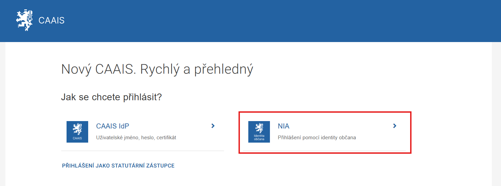

.. _prihlaseni_AIS_NIA:

Přihlášení k AIS Identitou občana (NIA)
---------------------------------------

Jestliže si vyberete ověření totožnosti prostřednictvím **Identity občana (NIA)**, CAAIS vás rozpozná na základě informací poskytnutých NIA a předá agendovému informačnímu systému informaci o vaší úspěšné autentizaci včetně sady vašich oprávnění (přístupových a činnostních rolí).

