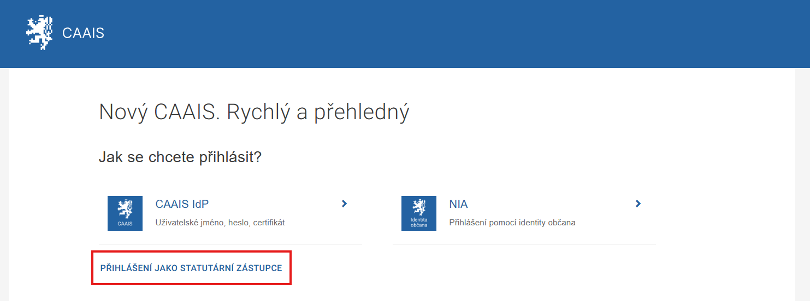
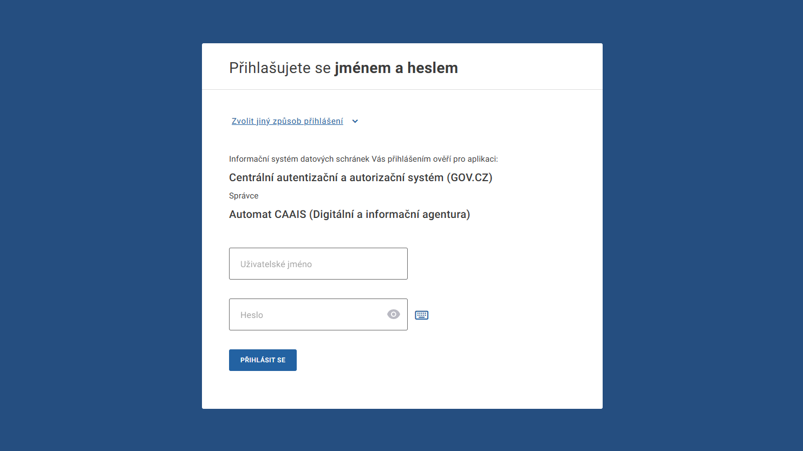
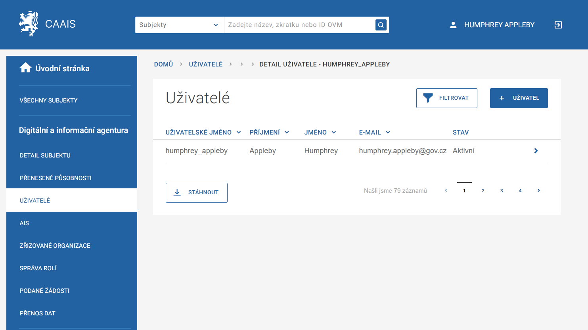
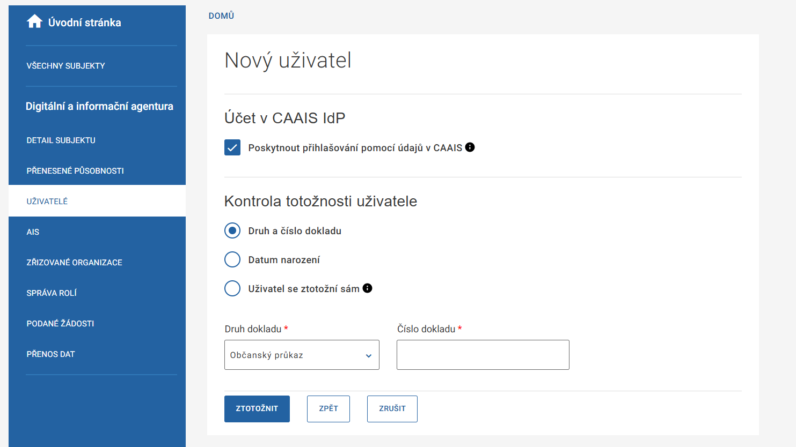

.. _sz_prirucka_zalozeni_la_CAAIS:

========================================================
Založení lokálního administrátora po přihlášení do CAAIS
========================================================

Pro manuální založení lokálního administrátora přímo v `rozhraní CAAIS <https://caais.gov.cz/login>`_ je zapotřebí se do systému přihlásit. V roli statutární zástupce se můžete přihlásit prostřednictvím :ref:`Identity občana (NIA) <sz_prirucka_zalozeni_la_CAAIS-prihlaseni_NIA>` nebo přístupových údajů k datové schránce :ref:`ISDS <sz_prirucka_zalozeni_la_CAAIS-prihlaseni_CAAIS_DS>`.

.. _sz_prirucka_zalozeni_la_CAAIS-prihlaseni_NIA:

Přihlášení prostřednictvím NIA (Národní identifikační autority) 
===============================================================

Na přihlašovací stránce CAAIS vyberete způsob přihlášení **„NIA“**. Po kliknutí se dostanete do jejího rozhraní a po úspěšném přihlášení budete přesměrováni do administrativního prostředí systému CAAIS.

.. include:: prihlaseni/prihlaseni_NIA.rst 

.. grid:: 1

   .. grid-item-card:: :ref:`Postup pro přihlášení prostřednictvím NIA <prihlaseni_NIA>`
      :text-align: center

.. _sz_prirucka_zalozeni_la_CAAIS-prihlaseni_CAAIS_DS:

Přihlášení do CAAIS datovou schránkou
=====================================

Na přihlašovací stránce vyberte **„Přihlášení jako statutární zástupce“**. Systém vás přesměruje do rozhraní datových schránek, kde vyplníte své přihlašovací údaje. Pro tento účel lze použít libovolný účet svázaný s vaší identitou, tedy jak k datové schránce fyzické osoby nebo subjektu, jehož jste statutárním zástupcem.

.. admonition:: Upozornění
   :class: warning
   
   **Pokud byste se do CAAIS chtěli prostřednictvím datové schránky přihlásit ještě někdy v budoucnu, použijte prosím vždy stejný účet.**

Po úspěšném ověření identity vstoupíte do profilu vašeho subjektu. Jakožto statutární zástupce zde máte možnost :ref:`zakládat profily <sz_prirucka_zalozeni_la_CAAIS_profil>` novým uživatelům, editovat jejich údaje a :ref:`přidělovat či odebírat <sz_prirucka_zalozeni_la_CAAIS_prideleni_odebrani>` jim role lokálního administrátora.

.. _sz_prirucka_zalozeni_la_CAAIS_profil:

Založení uživatelského profilu pro lokálního administrátora
-----------------------------------------------------------

Aby bylo možné přidělit uživateli roli :ref:`lokálního administrátora <la_prirucka>`, je potřeba mu nejdříve založit profil. Proces založení je stejný jako v případě :ref:`běžného uživatele <bu_prirucka>`, protože lokálním administrátorem se uživatel stává až přidělením příslušné role.

.. admonition:: Upozornění
   :class: warning
   
   **Přidělit a odebrat roli lokálního administrátora může jen statutární zástupce subjektu, a to vždy u konkrétního uživatele v záložce Správa rolí.**

1. Pro založení nového uživatele klikněte na položku **Uživatelé** v levém menu. Zobrazí se seznam všech již existujících uživatelů (který bude v případě prvního přihlášení obsahovat pouze vaše jméno).
2. Pokračujte kliknutím na **+UŽIVATEL**.

3. Systém vás přesměruje na formulář, do kterého vyplníte požadované údaje o zakládaném uživateli. Možné je zadat i mobilní telefonní číslo, na které si uživatel bude moci nechat posílat jednorázové ověřovací kódy.

.. note::
   
    Povinná políčka jsou označena hvězdičkou. Uživatelské jméno se vygeneruje automaticky na základě jména a příjmení, zvolit ovšem můžete i vlastní.

    Důležité je správně zadat e-mailovou adresu, kam zakládanému uživateli přijde e-mail informující ho o založení účtu a obsahující přihlašovací údaje.

4. Po vyplnění klikněte na tlačítko **POKRAČOVAT**. Přejdete ke :ref:`ztotožnění <sz_prirucka_zalozeni_la_CAAIS_ztotozneni>` zakládaného uživatele.

.. _sz_prirucka_zalozeni_la_CAAIS_ztotozneni:

Ztotožnění uživatele
--------------------

Do systému CAAIS mohou vstupovat pouze uživatelé, kteří byli řádně ztotožněni. Ztotožnění je možné provést několika způsoby:

- na základě :ref:`dokladu totožnosti <sz_prirucka_zalozeni_la_CAAIS_ztotozneni_doklad>`,
- prostřednictvím :ref:`data narození <sz_prirucka_zalozeni_la_CAAIS_ztotozneni_datum>`,
- :ref:`samoztotožněním uživatele <sz_prirucka_zalozeni_la_CAAIS_ztotozneni_samoztotozneni>` nebo
- tzv. :ref:`výjimkou <sz_prirucka_zalozeni_la_CAAIS_ztotozneni_vyjimka>`.

Na stránce naleznete defaultně vybranou volbu **„Poskytnout přihlašování pomocí údajů v CAAIS“**. Znamená to, že systém zajistí odeslání notifikace uživateli s výzvou k :ref:`aktivaci účtu <XXX>`, případně k tzv. :ref:`doztotožnění <XXX>`. Pokud tuto možnost nezvolíte, uživatel se nebude moci přihlašovat pomocí přihlašovacích údajů vydaných v CAAIS IdP, nicméně účet mu vznikne a bude se moci přihlašovat pomocí jiných prostředků, jmenovitě pomocí NIA.

.. _sz_prirucka_zalozeni_la_CAAIS_ztotozneni_doklad:

Ztotožnění prostřednictvím dokladu totožnosti
^^^^^^^^^^^^^^^^^^^^^^^^^^^^^^^^^^^^^^^^^^^^^

V sekci Kontrola totožnosti uživatele zaškrtněte volbu **„Druh a číslo dokladu”**. Z rolovací nabídky vyberte požadovaný druh dokladu a do vedlejšího pole vyplňte jeho číslo. Klikněte na tlačítko **ZTOTOŽNIT**.

.. _sz_prirucka_zalozeni_la_CAAIS_ztotozneni_datum:

Ztotožnění prostřednictvím data narození
^^^^^^^^^^^^^^^^^^^^^^^^^^^^^^^^^^^^^^^^

Pro ztotožnění prostřednictvím data narození zaškrtněte volbu **„Datum narození”**. Vyplňte číslice nebo navolte datum prostřednictvím vyskakovacího kalendáře. Klikněte na tlačítko **ZTOTOŽNIT**.

Pokud byla nalezena jedinečná osoba s uvedeným datem narození, je uživatel úspěšně ztotožněn. V opačném případě se zobrazí hláška *„Podle zadaných údajů jsme nalezli více osob. Doplňte další údaje pro přesnější vyhledání v registru obyvatel.“* a systém vás vyzve k doplnění dalších osobních údajů. Po jejich úspěšné kontrole se v horní části obrazovky zobrazí zelený proužek informující o úspěšném ztotožnění a založení uživatelského profilu.

.. _sz_prirucka_zalozeni_la_CAAIS_ztotozneni_samoztotozneni:

Ověření totožnosti uživatelem (samoztotožnění)
^^^^^^^^^^^^^^^^^^^^^^^^^^^^^^^^^^^^^^^^^^^^^^

Při zakládání uživatelského profilu se můžete dostat do situace, kdy nebudete mít k dispozici potřebné osobní údaje. V tom případě využijte možnost tzv. samoztotožnění uživatele.

Postupujte jako v případě běžného zakládání uživatelského účtu, ovšem v sekci „Kontrola totožnosti uživatele“ zvolte možnost **„Uživatel se ztotožní sám“** a pokračujte kliknutím na **DOKONČIT**.

.. admonition:: Poznámka
   :class: note
   
   Objeví se zelený proužek informující o úspěšném založení profilu a uživateli je zároveň poslán :ref:`e-mail s odkazem na stránku, na níž ztotožnění dokončí <XXX>`. Pozor, odkaz má omezenou platnost.

Dokud uživatel proces ztotožnění nedokončí, bude se u jeho jména zobrazovat atribut **„Před ztotožněním“**. I uživateli s tímto atributem lze přidělit roli lokálního administrátora.

.. _sz_prirucka_zalozeni_la_CAAIS_ztotozneni_vyjimka:

Ztotožnění na výjimku
^^^^^^^^^^^^^^^^^^^^^

.. admonition:: Upozornění
   :class: warning

   **V CAAIS sice existuje možnost udělení tzv. výjimky ze ztotožnění, ovšem uživatel, jemuž byla výjimka udělena, nemůže zastávat roli lokálního administrátora.**

.. _sz_prirucka_zalozeni_la_CAAIS_prideleni_odebrani:

Přidělení/Odebrání role lokálního administrátora
------------------------------------------------

Pro jakékoli další přidělení nebo odebrání role lokálního administrátora se přihlaste do svého profilu v CAAIS prostřednictvím některého z poskytovatelů identit (CAAIS IdP, NIA, ISDS).

.. grid:: 2

   .. grid-item-card:: :ref:`Přidělení role lokálního administrátora <sz_prirucka_prideleni_la>`
      :text-align: center

   .. grid-item-card:: :ref:`Odebrání role lokálního administrátora <sz_prirucka_odebrani_la>`
      :text-align: center

Odhlášení ze systému
--------------------

Odhlášení probíhá ve dvou krocích. Jako první se odhlašujete z NIA, respektive datové schránky, posléze ze systému CAAIS.

Klikněte na tlačítko **ODHLÁŠENÍ** v pravém horním rohu obrazovky vedle vašeho jména. Budete přesměrováni na stránku s oznámením *„Opravdu se chcete odhlásit?“* Odklikněte Ano. Zobrazí se další hláška *„Chcete se odhlásit od IdP?“* Odklikněte opět Ano. Nyní jste odhlášení.