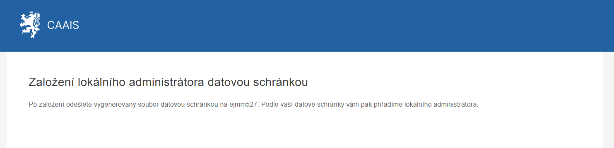
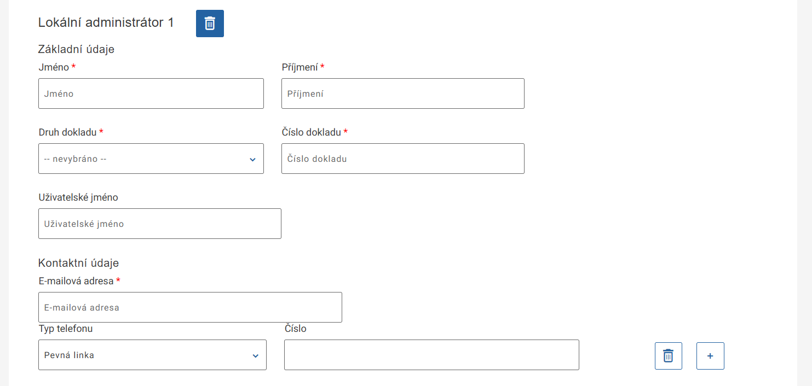
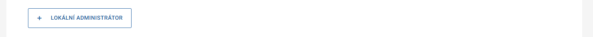
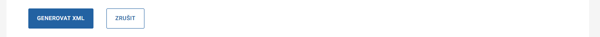

.. _sz_prirucka_zalozeni_la_ds:

=================================================
Založení lokálního administrátora datovou zprávou
=================================================

O vytvoření profilu a přidělení role :ref:`lokálního administrátora <la_prirucka>` můžete požádat i prostřednictvím formuláře a odesláním jeho výstupu datovou schránkou. Pokud se pro takovou možnost rozhodnete, rozklikněte na hlavní stránce CAAIS odkaz `Založení lokálního administrátora datovou schránkou <https://caais.gov.cz/la-create>`_, který vás přesměruje na online formulář.

1. Do formuláře vyplňte všechna pole označená hvězdičkou. Kromě **jména** a **příjmení** je nutné zvolit i **druh dokladu totožnosti** a uvést jeho **číslo**. Bez úspěšného ztotožnění není založení lokálního administrátora možné. Povinné je i vyplnění **e-mailové adresy**, na kterou uživateli přijde e-mail obsahující jeho uživatelské jméno a odkaz pro první přihlášení. Pokud zadáte i jeho **telefonní číslo**, při pozdější autentifikaci si bude moci vybrat, jestli mu bude poslán jednorázový ověřovací kód e-mailem, nebo prostřednictvím SMS.

2. V případě potřeby lze založit i několik lokálních administrátorů najednou. Stačí kliknout na **„+ Lokální administrátor“** a ve formuláři se zobrazí další pole. Pokud si založení dalšího administrátora rozmyslíte, stačí kliknout na ikonu popelnice.

.. admonition:: Upozornění
   :class: warning
   
   **Nezapomeňte, že všichni takto založení uživatelé budou mít v systému CAAIS roli lokálního administrátora a budou moci spravovat váš subjekt i jeho uživatele.**

3. Po vyplnění všech údajů klikněte na **„Generovat XML“**. Do počítače se vám stáhne XML soubor, který odešlete z datového schránky vašeho subjektu (organizace) do datové schránky systému CAAIS **ejmm527**. Vyrozumění o zpracování žádosti vám systém odešle do datové schránky během několika minut.

Jakmile je žádost o založení profilu schválena, uživateli přijde e-mail obsahující jeho přihlašovací jméno a link na stránku pro první přihlášení, případně pro samoztotožnění (pokud již nějaký profil v CAAIS měl).