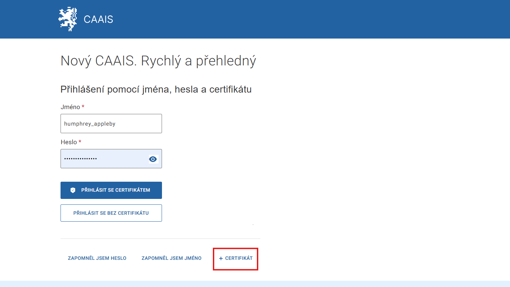
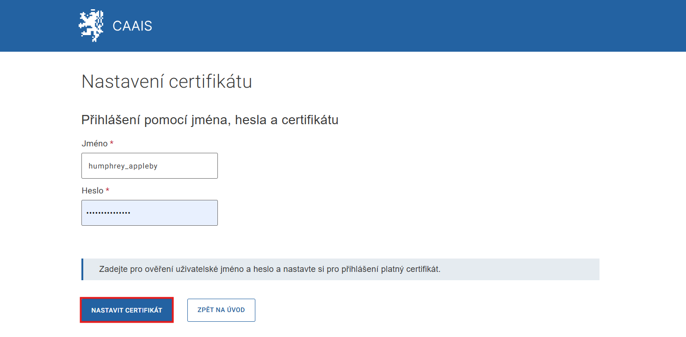
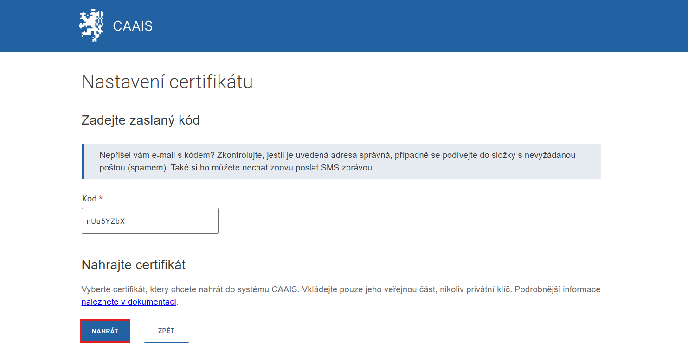
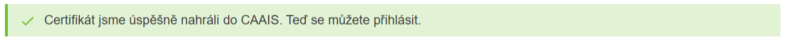

.. _email_CAAIS_IdP:

Byl vám založen nový účet v CAAIS IdP
=====================================

Jakmile vám lokální administrátor (nebo statutární zástupce v případě LA) účet založí, budete o tom informováni prostřednictvím e-mailové zprávy. V této zprávě s předmětem **„Byl vám založen nový účet v CAAIS IdP“** naleznete své uživatelské jméno spolu s odkazem na přihlašovací stránky, kde je nejprve nutné :ref:`(1) nastavit heslo <email_CAAIS_IdP_aktivace>` a následně :ref:`(2) registrovat autentizační certifikát <email_CAAIS_IdP_certifikat>`.

**CAAIS lze plnohodnotně využívat, i pokud se budete** :ref:`autentizovat prostřednictvím Identity občana (NIA) <prihlaseni_NIA>`. **Pak výše uvedené nastavení hesla a registraci certifikátu nemusíte provádět.** Interní předpisy vašeho úřadu však přesto mohou vyžadovat, abyste si účet v CAAIS IdP zřídili.

.. admonition:: Upozornění
    :class: warning
    
    **Zpráva přijde na adresu, která byla do systému zadána během vaší registrace. Pokud víte, že vám byl účet zřízen, ale v doručené poště e-mail nevidíte, zkontrolujte složku „nevyžádaná pošta / spam“, případně kontaktujte lokálního administrátora.**

.. _email_CAAIS_IdP_aktivace:

Aktivace účtu
-------------

.. dropdown:: Postup aktivace účtu v CAAIS IdP
    :open:
    
    1. Odkaz z e-mailu vás přesměruje na stránku **„První přihlášení do CAAIS IdP“** a vyzve k vyplnění uživatelského jména. Jakmile jej vyplníte, klikněte na tlačítko **POKRAČOVAT**.

    .. figure:: ../images/BU_CAAIS-IdP_Au-1.png
        :alt: První přihlášení do CAAIS IdP
        :width: 1000px

    2. Pro ověření shody potvrďte volbu zaslání na e-mail, případně SMS (v případě, že systém zná vaše mobilní telefonní číslo) a na další stránce jednorázový kód přepište do příslušného pole.

    .. figure:: ../images/BU_CAAIS-IdP_Au-2.png
        :alt: První přihlášení do CAAIS IdP
        :width: 1000px

    3. Dalším krokem je vytvoření hesla. Systém vyžaduje heslo o minimálně 10 znacích a obsahující alespoň jedno velké písmeno. Pro kontrolu heslo zopakujte a klikněte na **POKRAČOVAT**.

    .. figure:: ../images/BU_CAAIS-IdP_Au-3.png
        :alt: První přihlášení do CAAIS IdP
        :width: 1000px

    4. Jestliže všechny kroky proběhly správně, pokračujte volbou **K PŘIHLÁŠENÍ**.

    .. figure:: ../images/BU_CAAIS-IdP_Au-4.png
        :alt: První přihlášení do CAAIS IdP
        :width: 1000px

.. _email_CAAIS_IdP_certifikat:

První nahrání certifikátu do CAAIS
----------------------------------

Systém CAAIS umožňuje všem uživatelům přístup do administračního prostředí, kde mohou spravovat své osobní údaje. Pro jejich úpravu je nutné se do systému přihlásit pod ověřenou identitou. Identita se ověřuje na základě osobního komerčního certifikátu nebo prostřednictvím přihlášení přes Identitu občana / Národní identitní autoritu (NIA).

.. attention::

   **Pozor, následující kroky předpokládají, že máte v počítači nainstalovaný certifikát nebo disponujete účtem NIA ID.**

Pro nahrání certifikátu je nutné se do systému CAAIS přihlásit pod svým účtem. Lze zvolit z následujících možností přihlášení:

- :ref:`první přihlášení prostřednictvím CAAIS IdP <email_CAAIS_IdP_pp_CAAIS_IdP>`,
- :ref:`první přihlášení Identitou občana / NIA <email_CAAIS_IdP_pp_NIA>`.

.. _email_CAAIS_IdP_pp_CAAIS_IdP:

První přihlášení prostřednictvím CAAIS IdP
^^^^^^^^^^^^^^^^^^^^^^^^^^^^^^^^^^^^^^^^^^

Pokud zvolíte přihlášení prostřednictvím CAAIS IdP, certifikát nahrajete následujícím způsobem:

1. Pod přihlašovacím formulářem najděte text **+ CERTIFIKÁT**. Klikněte na něj.

2. V dalším kroku vyplntě své uživatelské jméno a heslo a následně klikněte na **NASTAVIT CERTIFIKÁT**.

3. Systém vám pošle e-mail nebo SMS s ověřovacím kódem.

4. Na následující stránce zadejte obdržený kód do příslušného pole a klikněte na tlačítko **NAHRÁT**. V počítači vyskočí okno s nabídkou certifikátů, které v něm máte nainstalované. Vyberte správný certifikát a potvrďte.

Objeví se zelený proužek: **„Certifikát jsme úspěšně nahráli do CAAIS. Teď se můžete přihlásit“**.

Nyní se můžete do svého účtu v systému CAAIS přihlašovat prostřednictvím jména, hesla a certifikátu a zároveň používat účet CAAIS pro přihlašování do agendových informačních systémů vyžadující značnou mírou zabezpečení.

.. admonition:: Poznámka
   :class: note
   
   Certifikát za vás mohl do CAAIS nahrát i lokální administrátor. V takovém případě nebudete k nahrávání certifikátu vyzváni a přecházíte rovnou k přihlášení.

.. _email_CAAIS_IdP_pp_NIA:

První přihlášení Identitou občana / NIA
^^^^^^^^^^^^^^^^^^^^^^^^^^^^^^^^^^^^^^^

Jestliže se do účtu přihlásíte prostřednictvím Identity občana, CAAIS vás rozpozná na základě informací poskytnutých NIA. V takovém případě je možné nahrát certifikát přímo v administračním prostředí CAAIS skrze volbu „Správa certifikátů“.

Pro detailní návod přejděte prosím do článku „Správa vlastního účtu - Certifikáty“.

Nápovědu k NIA ID naleznete na stránce https://info.identita.gov.cz/.

.. admonition:: Poznámka
   :class: note
   
   Pokud se budete přihlašovat výhradně prostřednictvím NIA, nahrání certifikátu není nutné. V takovém případě ale přijdete o možnost používat CAAIS IdP, tedy přihlášení prostřednictvím jména, hesla a certifikátu.
