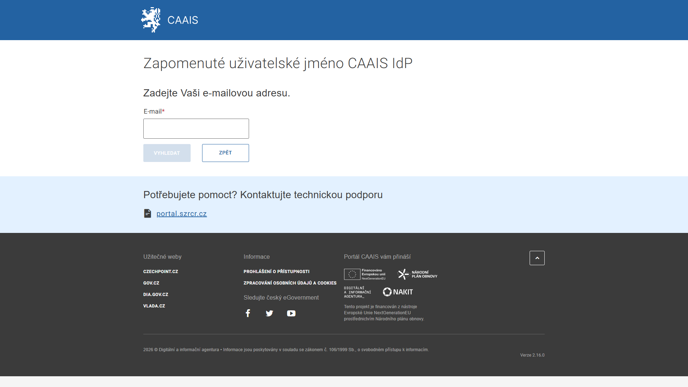

.. _nemam_ucet:

Nemám profil v CAAIS, ani účet v CAAIS IdP
==========================================

Nejste si jistí, zda máte v CAAIS účet? Zkuste využít možnost **ZAPOMENUTÉ UŽIVATELSKÉ JMÉNO**. Do políčka vyplňte svůj pracovní e-mail. Pokud účet v CAAIS máte, přijde vám v odpovědi vaše uživatelské jméno. Na jeho základě si můžete požádat i o nové heslo.

.. admonition:: Upozornění
   :class: warning

   **Tento postup platí pouze pro běžného uživatele. Pokud máte být lokálním administrátorem a účet v CAAIS dosud nemáte, obraťte se na svého statutárního zástupce, který je povinen vám účet lokálního administrátora zřídit.**

.. admonition:: Poznámka
   :class: note
   
   Jestliže se vám nepodařilo přihlásit a domníváte se, že účet v CAAIS nemáte, doporučujeme kontaktovat pracovníka, který vám nastavuje přístupy v JIP/KAAS, případně vydává komerční a kvalifikované certifikáty. Pokud se vám lokálního administrátora žádným uvedeným způsobem nepovede najít, kontaktujte technickou podporu: **portal.szrcr.cz**