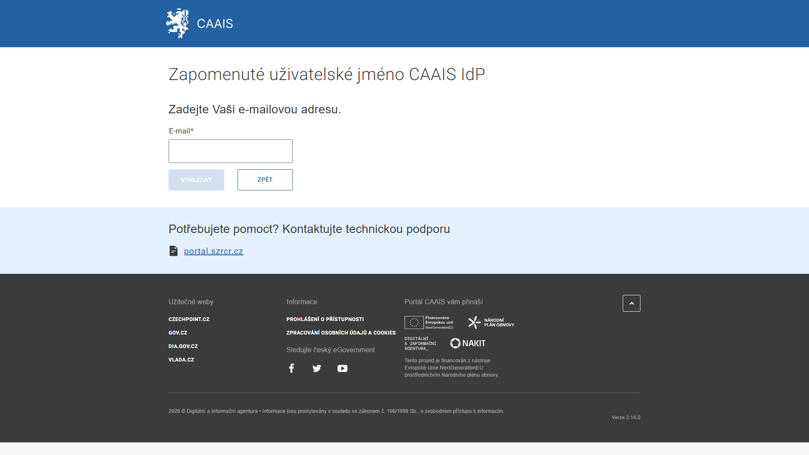

.. _nemam_ucet:

Nemám profil v CAAIS, ani účet v CAAIS IdP
==========================================

Nejste si jistí, zda máte v CAAIS účet? Zkuste využít možnost **ZAPOMENUTÉ UŽIVATELSKÉ JMÉNO**. Do políčka vyplňte svůj pracovní e-mail. Pokud účet v CAAIS máte, přijde vám v odpovědi vaše uživatelské jméno. Na jeho základě si můžete požádat i o nové heslo.

.. admonition:: Upozornění
   :class: warning

   **Tento postup platí pouze pro běžného uživatele. Pokud máte být lokálním administrátorem a účet v CAAIS dosud nemáte, obraťte se na svého statutárního zástupce, který je povinen vám účet lokálního administrátora zřídit.**

Kdo je vaším lokálním administrátorem můžete snadno zjistit prostřednictvím `formuláře „Zjisti mého lokálního administrátora CAAIS“ <https://caais.gov.cz/la-contact>`_. Stačí zadat svůj pracovní e-mail a na něj vám budou zaslány kontaktní údaje a další instrukce. Pokud e-mail nebude rozpoznán, obraťte se na pracovníky ICT oddělení nebo administrátory systému JIP/KAAS ve vaší organizaci.

.. admonition:: Poznámka
   :class: note
   
   Pokud se vám lokálního administrátora nepodaří dohledat, kontaktujte technickou podporu: `helpdesk.dia.gov.cz“ <https://helpdesk.dia.gov.cz/la-contact>`_