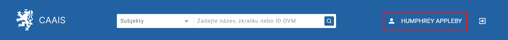
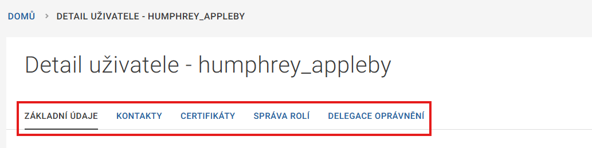

.. _sprava_uctu:

Správa vlastního účtu
=====================

Správa vlastního účtu je stejná pro :ref:`statutární zástupce <sz_prirucka>`, :ref:`lokálního administrátora <la_prirucka>` i :ref:`běžného uživatele <bu_prirucka>`.

Pro zobrazení detailu vašeho uživatelského účtu klikněte na své jméno v pravém horním rohu obrazovky.

V detailu můžete přepínat mezi záložkami :ref:`základní údaje <sprava_uctu_zakladni-udaje>`, :ref:`kontakty <sprava_uctu_kontakty>`, :ref:`certifikáty <sprava_uctu_certifikaty>`, :ref:`správa rolí <sprava_uctu_sprava-roli>` a :ref:`delegace oprávnění <sprava_uctu_delegace-opravneni>`.

.. _sprava_uctu_zakladni-udaje:

Základní údaje
--------------

Na záložce Základní údaje je uvedeno, jakým způsobem došlo k vašemu ztotožnění (nejčastěji „Uživatele jsme ztotožnili v ROB“) a nacházejí se zde vaše osobní údaje. Uvidíte zde i svou fotografii, pokud vám ji ovšem lokální administrátor nahrál. Chcete-li ji odstranit, změnit, nebo naopak přidat, požádejte lokálního administrátora. Sami tuto akci provést nemůžete.

.. admonition:: Poznámka
   :class: note
   
   Upozorňujeme, že některé z osobních údajů jsou porovnávány s registrem obyvatel, nemůžete je tudíž editovat. Upravovat lze pouze údaje v záložce Kontakty.

.. _sprava_uctu_kontakty:

Kontakty
--------

V záložce lze v případě potřeby aktualizovat vaši e-mailovou adresu a telefonní číslo. E-mailová adresa a mobilní telefonní číslo se přenáší do CAAIS IdP, kde slouží k zaslání kódu pro přihlášení. Pokud byste chtěli přidat další telefonní číslo, klikněte na ikonku „+“.

.. _sprava_uctu_certifikaty:

Certifikáty
-----------

Záložka Certifikáty slouží pro kontrolu současných a nahrávání nových osobních komerčních certifikátů. Certifikát, který už z jakéhokoli důvodu nepotřebujete, smažete kliknutím na ikonku koše. Pokud chcete nahrát nový certifikát, zaškrtněte, odkud jej budete nahrávat (zda jej máte uložený ve složce v počítači, nebo v internetovém prohlížeči), a pokračujte kliknutím na tlačítko NAHRÁT CERTIFIKÁT.

.. admonition:: Poznámka
   :class: note
   
   Jestliže v počítači ani v prohlížeči certifikát nemáte nebo se vám nahrávání nepodaří provést, obraťte se na svého lokálního administrátora.

.. _sprava_uctu_sprava-roli:

Správa rolí
-----------

Na záložce Správa rolí si lze zkontrolovat, jestli máte přidělené všechny přístupové a činností role, které potřebujete. V případě nejasností se obraťte na svého lokálního administrátora. Sami si role nemůžete ani přidávat, ani odebírat.

.. _sprava_uctu_delegace-opravneni:

Delegace oprávnění
------------------

Poslední záložka bude obsahovat záznam pouze pokud vám lokální administrátor dočasně přiřadil role některého jiného uživatele, například z důvodu zástupu během dovolené. Delegace je časově omezená a po jejím vypršení je záznam automaticky odstraněn.