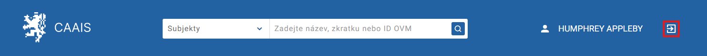

.. _bu_prirucka:

==========================
Příručka běžného uživatele
==========================

**Centrální autentizační a autorizační informační systém (CAAIS)** je centrální přihlašovací systém veřejné správy, který běžnému uživateli umožňuje jednotné a bezpečné přihlášení do agendových informačních systémů (AIS). Slouží především jako vstupní bod, díky kterému se uživatel po jednom přihlášení může dostat k systémům, ke kterým má přidělená oprávnění.

Vzhledem k tomu, že CAAIS postupně nahrazuje původní systém JIP/KAAS, je potřeba, aby se uživatel řídil pokyny :ref:`lokálního administrátora <bu_prirucka_LA>` a provedl nezbytné kroky k aktivaci svého účtu. Pro usnadnění práce se systémem je k dispozici uživatelská nápověda, včetně přehledných instruktážních materiálů.

.. _bu_prirucka_zalozeni_uctu:

Založení účtu a první přihlášení
================================

.. dropdown:: Chci účet v CAAIS
   :open:

   O zřízení účtu v CAAIS požádejte vašeho :ref:`lokálního administrátora <bu_prirucka_LA>`. Ten vám založí účet a přidělí potřebné role pro přístup k agendovým informačním systémům. Po založení účtu vám bude zaslán :ref:`e-mail s pokyny pro aktivaci <bu_prirucka_LA_zalozeni>` vašeho profilu v CAAIS.

   .. admonition:: Upozornění
      :class: warning
      
      **Pokud jste žádný email neobdrželi, pravděpodobně nemáte profil v CAAIS, ani účet v CAAIS IdP.**

   .. grid:: 1

      .. grid-item-card:: :ref:`Nemám profil v CAAIS, ani účet v CAAIS IdP“ <nemam_ucet>`
         :text-align: center

.. _bu_prirucka_LA:

Kdo je lokálním administrátorem?
--------------------------------

Jak zjistím, kdo je můj lokální administrátor? Ve většině případů je to váš **administrátor JIP / KAAS**, případně osoba zodpovědná za IT oddělení vašeho úřadu.

.. admonition:: Poznámka
   :class: note
   
   Pokud již účet v CAAIS máte, po přihlášení najdete kontakt na lokálního administrátora v patičce stránky po rozkliknutí textu **KONTAKTNÍ ÚDAJE**.

   .. figure:: ../images/data-image-3.jpg
      :alt: Kdo je lokálním administrátorem?
      :width: 1000px

.. _bu_prirucka_LA_zalozeni:

Založení profilu v CAAIS a aktivace účtu
----------------------------------------

Jakmile vám :ref:`lokální administrátor <bu_prirucka_LA>` založí účet, budete o tom informováni prostřednictvím e-mailové zprávy s předmnětem **„Byl vám založen profil v CAAIS“** (a je potřeba se doztotožnit), případně s předmětem **„Byl vám založen nový účet v CAAIS IdP“** (pro již ztotožněné uživatele). Tento email obsahuje postup, podle kterého je potřeba provést první přihlášení a aktivaci vašeho uživatelského účtu.

.. admonition:: Upozornění
   :class: warning

   **Tento email mohl skončit v neprioritní složce vašeho e-mailového klienta, případně ve složce spam. Než kontaktujete vašeho lokálního administrátora, s tím že vám email nepřišel, zkuste dohledat adresáta: noreply@caais.gov.cz**

   **POZOR na phishing!** Legitimní email z CAAIS bude vždy odeslán z adresy **gov.cz**.

   Platnost odkazů v emailech je omezena (platnost je 30 dní). Pokud vám email s pokyny pro aktivaci účtu nepřišel, nebo odkazy v něm obsažené již nejsou platné, kontaktujte svého :ref:`lokálního administrátora <bu_prirucka_LA>`.

.. grid:: 1

   .. grid-item-card:: :ref:`Přišel mi email „Byl vám založen profil v CAAIS“ <email_CAAIS>`
      :text-align: center

.. grid:: 1

   .. grid-item-card:: :ref:`Přišel mi email Byl vám založen nový účet v CAAIS IdP“ <email_CAAIS_IdP>`
      :text-align: center

Přihlášení, odhlášení a zapomenuté údaje v CAAIS
================================================

Přihlášení
----------

Do systému CAAIS se lze přihlásit prostřednictvím CAAIS IdP, nebo Identitou občana / NIA.

.. admonition:: Poznámka
   :class: note
   
   Pokud se potřebujete do systému CAAIS přihlásit poprvé, postupujte podle pokynů v e-mailu, který vám byl zaslán po založení účtu. Podrobný postup je popsán výše v sekci :ref:`Založení účtu a první přihlášení <bu_prirucka_zalozeni_uctu>`.

Při přihlášení prostřednictvím **CAAIS IdP** se uživatel přihlašuje pomocí účtu vytvořeného přímo v systému CAAIS, tedy uživatelským tedy uživatelským jménem, heslem a certifikátem. Tento způsob se používá zejména u uživatelů, kterým je účet spravován v rámci organizace.

.. grid:: 1

   .. grid-item-card:: :ref:`Chci se přihlásit do systému CAAIS prostřednictvím CAAIS IdP <prihlaseni_CAAIS_IdP>`
      :text-align: center

Při přihlášení prostřednictvím **Identity občana (NIA)** se uživatel ověřuje pomocí již existujícího prostředku elektronické identity, například bankovní identity nebo eObčanky. CAAIS v tomto případě pouze převezme ověřenou identitu a uživatel se nemusí přihlašovat samostatnými údaji vytvořenými v CAAIS.

.. grid:: 1

   .. grid-item-card:: :ref:`Chci se přihlásit do systému CAAIS přes Identitu občana / NIA <prihlaseni_NIA>`
      :text-align: center

Odhlášení
---------

Jakmile se chcete z účtu odhlásit, klikněte na ikonu „Odhlášení“ v pravém horním rohu obrazovky vedle vašeho jména. Zobrazí se okno pro potvrzení volby. Klikněte na ANO. Nyní jste ze systému CAAIS odhlášeni.

.. admonition:: Poznámka
   :class: note
   
   Přihlašovali jste se skrze NIA? V tom případě budete vyzváni k odhlášení i v jejím rámci.

Zapomenuté údaje
----------------

Pro změnu hesla, nebo získání zapomenutých údajů postupujte podle návodu v následujícím odkazu:

.. grid:: 1

   .. grid-item-card:: :ref:`Zapomněl jsem své přihlašovací údaje <zapomenute_udaje>`
      :text-align: center

Správa vlastního účtu
=====================

Správa vlastního účtu je stejná pro :ref:`statutární zástupce <sz_prirucka>`, :ref:`lokálního administrátora <la_prirucka>` i :ref:`běžného uživatele <bu_prirucka>`.

.. grid:: 1

   .. grid-item-card:: :ref:`Jak spravovat svůj účet <sprava_uctu>`
      :text-align: center

Přihlašování k Agendovým informačním systémům
=============================================

Na přihlašovací stránce Agendového informačního systému (AIS) vyberte možnost, která bude obvykle označena **„PŘIHLÁSIT PŘES CAAIS”**, případně obdobně. Systém vás přesměruje na přihlašovací stránku CAAIS. Zde máte na výběr dvě možnosti:

.. grid:: 2

.. grid:: 2

   .. grid-item-card:: :ref:`Přihlášení přes CAAIS IdP <prihlaseni_AIS_CAAIS_IdP>`
      :text-align: center

   .. grid-item-card:: :ref:`Přihlášení Identitou občana / NIA <prihlaseni_AIS_NIA>`
      :text-align: center